# NotebookLM Slide Styles Collection

A curated collection of visual design styles (YAML) to customize the output of NotebookLM slide generation.

## 🌐 Website

Explore the collection interactively through our high-performance showcase site. Preview styles with rotating thumbnails, copy YAML prompts with a single click, and save your favorites.

- **Live Version:** [View the Showcase](https://notebooklm-prompt-styles.vercel.app/)

---

## 📖 Table of Contents

- [👔 Business & Executive](#-business-executive)
  - [Executive Report](#executive-report)
  - [Emerald Corporate](#emerald-corporate)
  - [Vibrant Corporate](#vibrant-corporate)
  - [Ensign Corporate](#ensign-corporate)
  - [Silicon Refined](#silicon-refined)
  - [Liquid Executive](#liquid-executive)
  - [Clinical Precision](#clinical-precision)
  - [Compassion Flat](#compassion-flat)
- [✨ Minimalist & Modern](#-minimalist-modern)
  - [Geometric Mono](#geometric-mono)
  - [Lush Minimal](#lush-minimal)
  - [Structured Mint](#structured-mint)
  - [Frosted Luxury](#frosted-luxury)
- [🎨 Creative & Playful](#-creative-playful)
  - [Creative Spark](#creative-spark)
  - [Artisan Rust](#artisan-rust)
  - [Vintage Charm](#vintage-charm)
  - [Creative Notebook](#creative-notebook)
  - [Kawaii Playful](#kawaii-playful)
  - [Y2K Nostalgia](#y2k-nostalgia)
  - [Creative Workshop](#creative-workshop)
  - [Creative Classroom](#creative-classroom)
  - [Hand-Drawn Scrapbook](#hand-drawn-scrapbook)
  - [Whimsical Animation](#whimsical-animation)
  - [Clinical Doodles](#clinical-doodles)
  - [Medicine Pop](#medicine-pop)
  - [Garden Doodles](#garden-doodles)
  - [Kawaii Storybook](#kawaii-storybook)
  - [Biochemical Doodles](#biochemical-doodles)
  - [Science Sketch](#science-sketch)
  - [Athletic Energy](#athletic-energy)
  - [Kawaii Wellness](#kawaii-wellness)
  - [Groovy 70s](#groovy-70s)
- [📖 Editorial & Magazine](#-editorial-magazine)
  - [Editorial Essence](#editorial-essence)
  - [Luxury Editorial](#luxury-editorial)
  - [Cobalt Editorial](#cobalt-editorial)
  - [Architectural Portfolio](#architectural-portfolio)
  - [Classical Gallery](#classical-gallery)
  - [Summer Collage](#summer-collage)
  - [Vision Board](#vision-board)
  - [Academic Edge](#academic-edge)
- [🚀 Tech & Innovation](#-tech-innovation)
  - [Visual Discovery](#visual-discovery)
  - [Urban Ribbon](#urban-ribbon)
  - [Neon Pulsar](#neon-pulsar)
  - [Midnight Tactical](#midnight-tactical)
  - [Architectural Mono](#architectural-mono)
  - [Architectural Cobalt](#architectural-cobalt)
  - [Startup Aura](#startup-aura)
  - [Neon Venture](#neon-venture)
- [🌿 Nature & Wellness](#-nature-wellness)
  - [Eco Modern](#eco-modern)
  - [Botanical Journal](#botanical-journal)
  - [The Seasons](#the-seasons)
  - [Scholar's Journal](#scholars-journal)
  - [Classical Scrapbook](#classical-scrapbook)
  - [Vibrant Agency](#vibrant-agency)
  - [Vitality Glow](#vitality-glow)
  - [Modern Wellness](#modern-wellness)
  - [Deep Forest](#deep-forest)
  - [Urban Jungle](#urban-jungle)
  - [Modern Farm](#modern-farm)
  - [Sustainable Agri](#sustainable-agri)
  - [Modern Harvest](#modern-harvest)
- [🚀 How to Use](#-how-to-use)
- [🛠️ Contribution](#-contribution)
- [🏗️ Acknowledgements](#-acknowledgements)
- [⚖️ Disclaimer](#-disclaimer)

---

## 🎨 Themes

> [!IMPORTANT]
> The code snippets below are **simplified previews** focused on design tokens. To get the full configuration (including image generation prompts and detailed components), use the **[View Full YAML]** link in each section.

### 👔 Business & Executive

#### Executive Report

Data-dense, executive style for professional reports. Focuses on statement-driven "Action Titles", rigorous grid structures, and professional high-fidelity visuals.

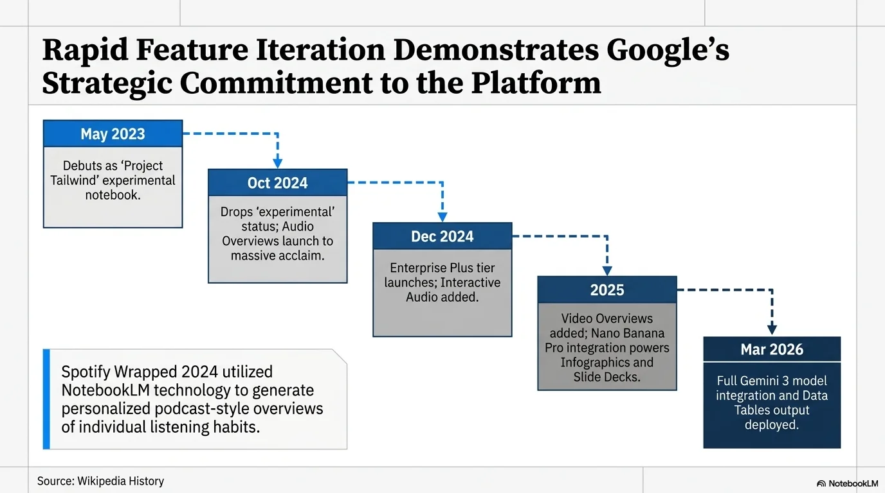

> [!TIP]
> This is a simplified preview. [View Full YAML](styles/executive_report.yaml)

```yaml
design_system:
  global_style:
    theme: "Professional, data-dense, and executive. Inspired by high-end consulting report standards. Focuses on statement-driven 'Action Titles', rigorous grid layouts, and high-impact data visualization."
    typography: 
      primary_heading: "Authoritative serif (e.g., Times New Roman, Georgia), bold, statement-driven"
      secondary_heading: "Clean professional sans-serif (e.g., Helvetica, Arial), bold"
      body_text: "Functional sans-serif, standard weights, high density"
    color_palette:
      primary_color: "#051C2C"
      background: "#FFFFFF"
      text_main: "#333333"
      accent_color: "#007DBB"
      secondary_accent: "#999999"
    key_visual_elements: 
      - "Full-width horizontal dividers for header and footer separation"
      - "High-information density"
      - "Source and Footer attribution blocks"
      - "Waterfall and Stacked bar chart motifs in icons"

  image_generation_prompts:
    style_guidelines: "Clean professional white background, deep blue accents, business-centric data visualization, executive presentation style."

slide_layout_templates:
  - type: "Executive_Action_Title"
    usage: "Standard consulting slide with a key insight title"
  - type: "Waterfall_Insight"
    usage: "Dynamic financial or process flow visualization"
  - type: "Quad_Analysis"
    usage: "Comparison of four key metrics"
```

#### Emerald Corporate

A professional, executive-level design featuring a deep forest green palette with sharp crystalline geometric overlays. It uses metallic silver accents and glassmorphic cards to create a high-tech, authoritative corporate atmosphere.

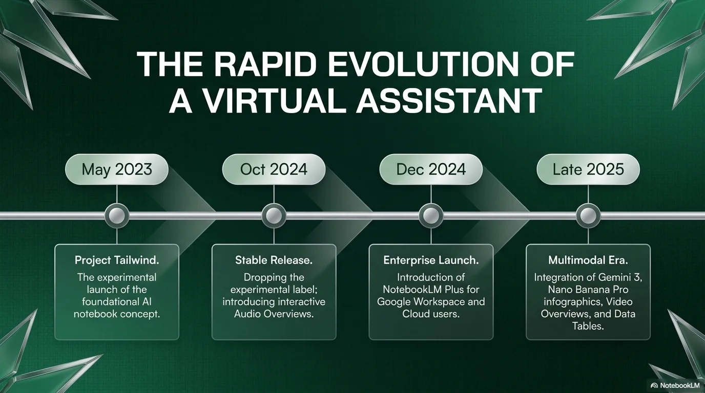

> [!TIP]
> This is a simplified preview. [View Full YAML](styles/emerald_corporate.yaml)

```yaml
design_system:
  global_style:
    theme: "Professional, executive, and high-tech. Deep emerald green with metallic silver accents."
    typography: 
      primary_heading: "Bold authoritative sans-serif, primarily uppercase"
      secondary_heading: "Medium weight sans-serif, clean"
      body_text: "Light-weight, highly legible sans-serif"
    color_palette:
      primary_color: "#0F3024"
      background: "Deep emerald with crystalline geometric shards"
      text_main: "#FFFFFF"
      accent_color: "#C0C0C0"
    key_visual_elements: 
      - "Sharp geometric shards with silver reflections"
      - "Pill-shaped gradient labels"
      - "Glassmorphic content cards"
      - "Professional office-centric photography"

slide_layout_templates:
  - type: "Executive_Cover"
    usage: "Authoritative intro with geometric framing"
  - type: "Pill_Grid_Methodology"
    usage: "Structured presentation of steps or research"
  - type: "Glassmorphic_Data"
    usage: "Data-heavy slides with visual clarity"

#### Vibrant Corporate

A dynamic, forward-moving corporate aesthetic featuring high-contrast navy blue and vibrant lime green. It uses sharp geometric diagonals, chevron markers, and structured grids to convey professional excellence and modern momentum.


> [!TIP]
> This is a simplified preview. [View Full YAML](styles/vibrant_corporate.yaml)

```yaml
design_system:
  global_style:
    theme: "Modern, dynamic, and professional corporate aesthetic."
    typography: 
      primary_heading: "Bold geometric sans-serif (Montserrat)"
      secondary_heading: "Medium weight sans-serif"
      body_text: "Clean functional sans-serif"
    color_palette:
      primary_color: "#051C2C"
      secondary_color: "#4CAF50"
      background: "#FFFFFF"
      text_main: "#111111"
    key_visual_elements: 
      - "Dynamic diagonal color blocks and chevron overlays"
      - "Circular icons with navy backgrounds"
      - "Chevron-shaped pointers for list items"
      - "Modern architectural and cityscape photography"

slide_layout_templates:
  - type: "Corporate_Cover"
    usage: "Bold navy and green diagonals for business plans"
  - type: "Timeline_History"
    usage: "Horizontal timeline with circular navy nodes"
  - type: "Objective_Chevron"
    usage: "List with green chevron markers and architectural bleed"
```

#### Ensign Corporate

Modern corporate, dynamic, and professional design. Features a strong navy and vivid blue foundation with energetic yellow/orange accents and distinctive corner 'ribbon' layers for a high-impact business presentation.


> [!TIP]
> This is a simplified preview. [View Full YAML](styles/ensign_corporate.yaml)

```yaml
design_system:
  global_style:
    theme: "Modern corporate, dynamic, professional. Navy/Blue with Yellow accents."
    typography: 
      primary_heading: "Bold geometric sans-serif, uppercase"
      secondary_heading: "Medium-bold sans-serif, accent color"
      body_text: "Clean sans-serif, business readability"
      info_label: "Small bold uppercase pill labels"
    color_palette:
      primary_color: "#101D42"
      secondary_color: "#4A6CF7"
      accent_yellow: "#FFB400"
      background: "#F5F7FA"
    key_visual_elements: 
      - "Layered corner 'ribbons' (Navy and Blue stacking)"
      - "Pill-shaped accent backgrounds for labels"
      - "Bold circular iconography"
      - "Rounded cards for content blocks"

slide_layout_templates:
  - type: "Ensign_Cover"
    usage: "Professional business introduction"
  - type: "Ribbon_Team"
    usage: "Team introduction with individual roles"
  - type: "Icon_Service_Grid"
    usage: "Listing core services or features"
```

#### Silicon Refined

Ultra-minimalist, premium, and sleek. Focuses on generous whitespace, precision typography, and high-fidelity visuals. Designed for high-end technology presentations where clarity and elegance are paramount.

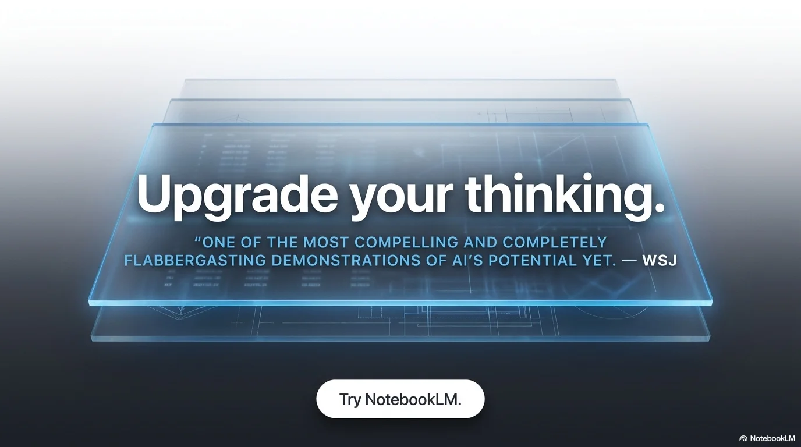

> [!TIP]
> This is a simplified preview. [View Full YAML](styles/silicon_refined.yaml)

```yaml
design_system:
  global_style:
    theme: "Ultra-minimalist, premium, and sleek. Generous whitespace and precision."
    typography: 
      primary_heading: "Clean high-quality sans-serif (e.g., SF Pro style), bold"
      secondary_heading: "Lightweight sans-serif, wide tracking"
      body_text: "Refined sans-serif, airy line-height"
    color_palette:
      primary_color: "#1D1D1F"
      background: "#FFFFFF"
      text_main: "#1D1D1F"
      accent_color: "#0071E3"
    key_visual_elements: 
      - "Generous whitespace (Airy layout)"
      - "High-resolution product-focused photography"
      - "Bento-style grids for features"

slide_layout_templates:
  - type: "Hero_Breathe"
    usage: "Impactful intro or single-statement slide"
  - type: "Bento_Grid_Specs"
    usage: "Showcasing multiple features or specifications"
  - type: "Feature_Gradient"
    usage: "Highlighting a breakthrough benefit"
```


#### Liquid Executive

A premium executive aesthetic characterized by flowing blue liquid and smoke textures on a solid black background. It features the elegant Garet typeface and ultra-rounded content containers. Ideal for high-stakes business presentations, corporate reports, and executive portfolios.

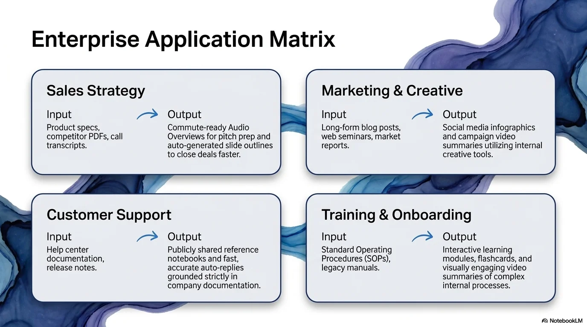

> [!TIP]
> This is a simplified preview. [View Full YAML](styles/liquid_executive.yaml)

```yaml
description: "A premium executive aesthetic characterized by flowing blue liquid and smoke textures on a solid black background. It features the elegant Garet typeface and ultra-rounded content containers. Ideal for high-stakes business presentations, corporate reports, and executive portfolios."
design_system:
  global_style:
    theme: "Liquid Executive. Professional corporate style with fluid blue textures and rounded layouts."
    typography: 
      primary_heading: "Garet, sans-serif"
      secondary_heading: "Garet, medium"
      body_text: "Open Sauce Sans, light"
    color_palette:
      primary: "#0056B3" # Executive Blue
      background: "#000000" # Pure Black
      surface: "#111111" # Dark Surface
      accent_gradient: "Flowing blue smoke texture with electric highlights"
      text_main: "#FFFFFF"
      text_secondary: "#CCCCCC"
    key_visual_elements: 
      - "Flowing blue liquid silk or smoke background patterns"
      - "Ultra-rounded corners for cards and images (24px+)"
      - "Thin white or light blue card outlines"
      - "Clean, high-contrast typography with generous leading"

  image_generation_prompts:
    style_guidelines: "Executive corporate style, flowing blue silk textures, deep black backgrounds, professional studio lighting, high-end business photography, sharp focus, Garet font vibe."
    themes:
      - target: "Corporate Flow"
        prompt_elements: "Abstract flowing blue smoke or liquid silk on a solid black background, elegant curves, high contrast."
      - target: "Modern Executive"
        prompt_elements: "Minimalist office interior with deep blue accents, professional lighting, clean and sophisticated."

slide_layout_templates:
  - type: "Executive_Hero"
    usage: "Large title over a dark background with a dramatic blue liquid wave on the right"
  - type: "Mission_Rounded"
    usage: "Mission and Vision points inside ultra-rounded blue cards with white text"
  - type: "Market_Analysis_Dark"
    usage: "Charts and data visualization with blue bar accents on a black background"
  - type: "Liquid_Contact"
    usage: "Clean contact info inside a rounded dark blue container with minimalist icons"
```


#### Clinical Precision

A modern, high-tech medical aesthetic designed for clinical and healthcare presentations. It utilizes the objective Helvetica World typeface, deep black backgrounds, and vibrant blue light glows. Characterized by large typography and sharp minimalist icons, it conveys trust and scientific precision.

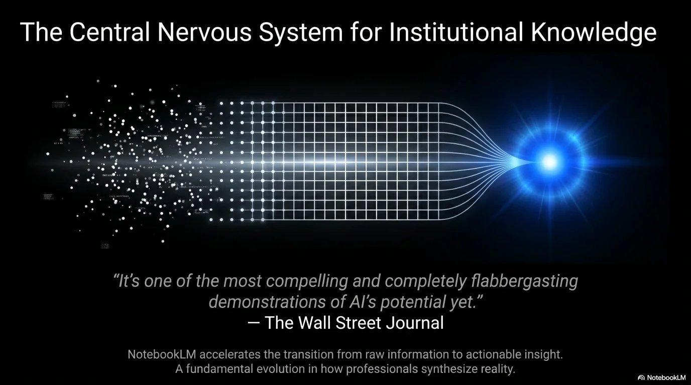

> [!TIP]
> This is a simplified preview. [View Full YAML](styles/clinical_precision.yaml)

```yaml
description: "A modern, high-tech medical aesthetic designed for clinical and healthcare presentations. It utilizes the objective Helvetica World typeface, deep black backgrounds, and vibrant blue light glows. Characterized by large typography and sharp minimalist icons, it conveys trust and scientific precision."
design_system:
  global_style:
    theme: "Clinical Precision. High-tech medical style with dark contrast and blue glows."
    typography: 
      primary_heading: "Helvetica World, sans-serif"
      secondary_heading: "Helvetica World, light"
      body_text: "Helvetica, Arial, sans-serif"
    color_palette:
      primary: "#2563EB" # Clinical Royal Blue
      background: "#000000" # Pure Black
      surface: "#111111" # Clinical Grey-Black
      accent_gradient: "Soft royal blue glow leaking from the edges"
      text_main: "#FFFFFF"
      text_secondary: "#A1A1AA"
    key_visual_elements: 
      - "Large minimalist arrow icons for calls to action"
      - "Subtle blue light leaks and glowing nodes on dark backgrounds"
      - "Thin 1px white horizontal dividers"
      - "Photography with clinical/modern medical subjects"

  image_generation_prompts:
    style_guidelines: "Modern medical photography, high-tech clinic environment, soft blue lighting glows, deep black backgrounds, clean professional medical aesthetic, sharp focus, Helvetica font vibe."
    themes:
      - target: "Medical Technology"
        prompt_elements: "Close-up of modern medical equipment with soft blue glow, clinical lighting, high-tech aesthetic, sharp focus."
      - target: "Care & Professionalism"
        prompt_elements: "A professional medical consultation in a modern clinic, soft blue ambient light, clean and trustworthy atmosphere."

slide_layout_templates:
  - type: "Medical_Title"
    usage: "Large title on a dark background with a massive arrow icon in the bottom right"
  - type: "Clinical_TOC"
    usage: "Table of contents with numbered list and soft blue background glow"
  - type: "Hospital_Timeline"
    usage: "Horizontal timeline with glowing nodes and blue spotlight effects"
  - type: "Data_Precision"
    usage: "Statistical highlights with large percentage numbers and subtle grid patterns"
```


#### Compassion Flat

A professional yet warm medical aesthetic utilizing modern flat 2D illustrations. It features the clean Poppins typeface, a serene palette of sky and navy blues, and large symbolic icons like medical crosses and hearts. Organized with rounded containers and soft shadows, it conveys institutional excellence with a human touch.

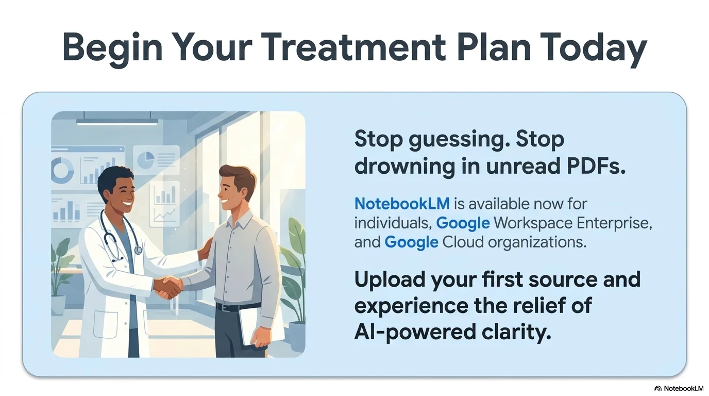

> [!TIP]
> This is a simplified preview. [View Full YAML](styles/compassion_flat.yaml)

```yaml
description: "A professional yet warm medical aesthetic utilizing modern flat 2D illustrations. It features the clean Poppins typeface, a serene palette of sky and navy blues, and large symbolic icons like medical crosses and hearts. Organized with rounded containers and soft shadows, it conveys institutional excellence with a human touch."
design_system:
  global_style:
    theme: "Compassion Flat. Modern 2D medical illustration style with a professional blue palette."
    typography: 
      primary_heading: "Poppins, sans-serif"
      secondary_heading: "Poppins, semi-bold"
      body_text: "Poppins, light"
    color_palette:
      primary: "#3B82F6" # Corporate Blue
      secondary: "#7EB1D1" # Sky Blue Matte
      background: "#FFFFFF" # Pure White
      surface: "#F8FAFC" # Light Slate Surface
      text_main: "#0F172A"
      text_secondary: "#475569"
    key_visual_elements: 
      - "Modern flat vector illustrations of healthcare professionals"
      - "Large decorative medical cross icons (+)"
      - "Rounded rectangular containers with subtle 1px borders"
      - "Clean, organized layouts with ample white space"

  image_generation_prompts:
    style_guidelines: "Flat 2D vector illustration, clean lines, no gradients, minimal shadows, corporate medical theme, professional characters, sky blue and white palette, Poppins font vibe."
    themes:
      - target: "Patient Care"
        prompt_elements: "A flat 2D illustration of a doctor talking to a patient, warm and professional vibe, clean vector style, blue and white tones."
      - target: "Medical Technology"
        prompt_elements: "Flat 2D illustration of a microscope and medical monitor, clean minimalist lines, medical blue accents, white background."

slide_layout_templates:
  - type: "Flat_Medical_Cover"
    usage: "Large title with a professional doctor illustration and a massive blue cross icon"
  - type: "Info_Card_Layout"
    usage: "Text contained in a rounded white card with a subtle shadow and sky blue title"
  - type: "Step_By_Step_Flat"
    usage: "Horizontal steps using circular icons and flat illustration characters"
  - type: "Medical_Components_Grid"
    usage: "A 2x2 grid of info cards with flat icons for each healthcare component"
```

---


### ✨ Minimalist & Modern

#### Geometric Mono

Professional, architectural, and monochromatic design. It uses a strong grayscale palette with geometric shapes and high-contrast photography to convey precision, structure, and corporate excellence.

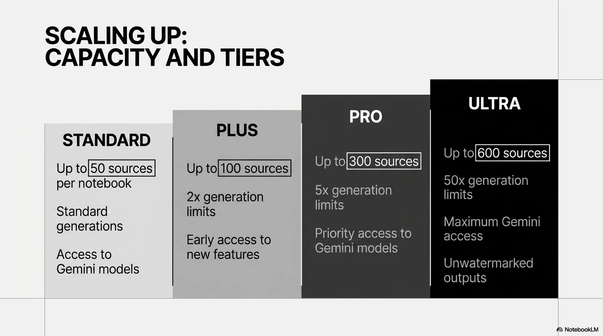

> [!TIP]
> This is a simplified preview. [View Full YAML](styles/geometric_mono.yaml)

```yaml
design_system:
  global_style:
    theme: "Professional, architectural, and monochromatic. Precision and structure."
    typography: 
      primary_heading: "Bold geometric sans-serif (e.g., Montserrat), uppercase"
      secondary_heading: "Medium weight sans-serif, clean"
      body_text: "Functional sans-serif, high contrast"
    color_palette:
      primary_color: "#FFFFFF"
      background: "#E0E0E0"
      text_main: "#000000"
      accent_color: "#333333"
    key_visual_elements: 
      - "High-contrast architectural grayscale photography"
      - "Diagonals and geometric color blocks"
      - "Circular icons with thin white outlines"

slide_layout_templates:
  - type: "Corporate_Summary"
    usage: "Executive summary or project overview"
  - type: "Geometric_Split"
    usage: "Comparing data or value propositions"
  - type: "Architectural_Timeline"
    usage: "Visualizing project phases or milestones"
```

#### Lush Minimal

Nature-inspired, organic, and soft design. It focuses on botanical imagery, sage greens, and large rounded corners to create a peaceful yet professional atmosphere.

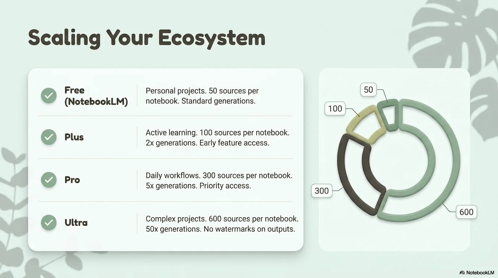

> [!TIP]
> This is a simplified preview. [View Full YAML](styles/lush_minimal.yaml)

```yaml
design_system:
  global_style:
    theme: "Nature-inspired, organic, and soft. Botanical focus."
    typography: 
      primary_heading: "Bold rounded sans-serif (e.g., Lexend)"
      secondary_heading: "Regular weight sans-serif"
      body_text: "Clean sans-serif with generous spacing"
    color_palette:
      primary_color: "#4A4A4A"
      background: "#F5F7F5"
      text_main: "#4A4A4A"
      accent_color: "#7A906E"
    key_visual_elements: 
      - "Botanical photography (monstera, succulents)"
      - "Large rounded corners (24px+)"
      - "Soft, subtle drop shadows"

slide_layout_templates:
  - type: "Botanical_Split"
    usage: "Intro slides or service highlights"
  - type: "Organic_Goals"
    usage: "Presenting multiple points or objectives"
  - type: "Sage_Data"
    usage: "Presenting metrics or growth"
```

#### Structured Mint

Professional, structured, and refreshing corporate design. Features distinctive tiered corner frames in mint green and dark teal, offering a clean and organized frame for business presentations.

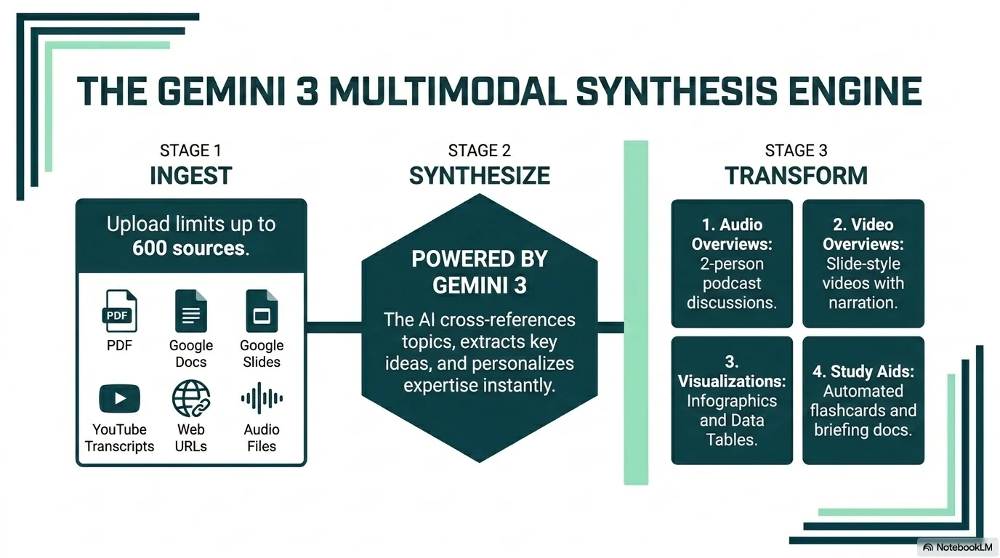

> [!TIP]
> This is a simplified preview. [View Full YAML](styles/structured_mint.yaml)

```yaml
design_system:
  global_style:
    theme: "Corporate, structured, and refreshing. Tiered corner frames and mint accents."
    typography: 
      primary_heading: "Bold geometric sans-serif (e.g., Montserrat), uppercase"
      secondary_heading: "Medium sans-serif, clean"
      body_text: "Functional sans-serif, optimized for readability"
    color_palette:
      primary_color: "#557A68"
      background: "#FFFFFF"
      accent_mint: "#B2EBF2"
      text_main: "#263238"
    key_visual_elements: 
      - "Tiered corner frames (Mint and Teal accents)"
      - "Pill-shaped category tags"
      - "Numbered grid boxes"
      - "Vertical mint-green accent bars"

slide_layout_templates:
  - type: "Structured_Cover"
    usage: "Impactful intro with tiered frames"
  - type: "Grid_Methodology"
    usage: "Listing steps or structured points"
  - type: "Content_Focus_Split"
    usage: "Image and text side-by-side"
```


#### Frosted Luxury

A sophisticated and high-end minimalist aesthetic inspired by luxury fragrance advertising. It features the refined Arial Nova typeface, a warm palette of beige and charcoal, and airy layouts with ample negative space. Characterized by frosted glass effects, high-fashion photography, and elegant thin borders, it conveys exclusivity and timeless elegance.

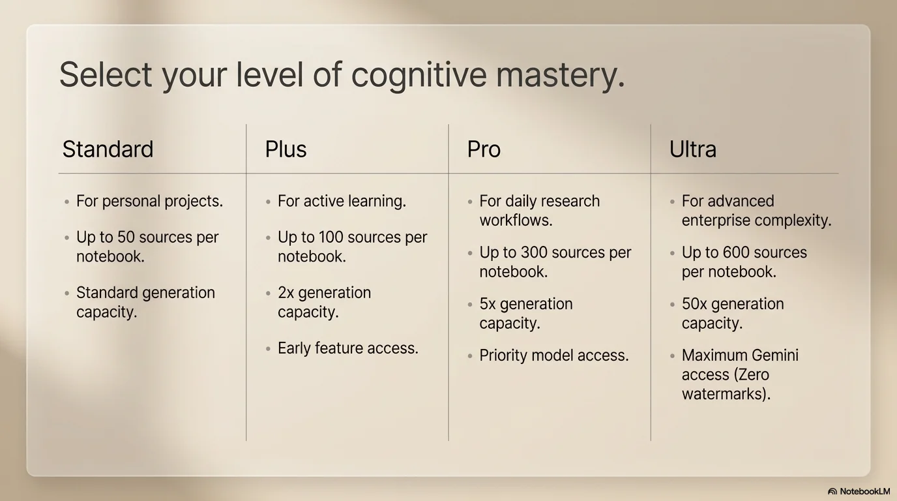

> [!TIP]
> This is a simplified preview. [View Full YAML](styles/frosted_luxury.yaml)

```yaml
description: "A sophisticated and high-end minimalist aesthetic inspired by luxury fragrance advertising. It features the refined Arial Nova typeface, a warm palette of beige and charcoal, and airy layouts with ample negative space. Characterized by frosted glass effects, high-fashion photography, and elegant thin borders, it conveys exclusivity and timeless elegance."
design_system:
  global_style:
    theme: "Frosted Luxury. High-end minimalist style with warm beige tones and editorial layouts."
    typography: 
      primary_heading: "Arial Nova, sans-serif"
      secondary_heading: "Arial Nova, light"
      body_text: "Arial Nova, regular"
    color_palette:
      primary: "#333333" # Stone Charcoal
      secondary: "#A8A29E" # Warm Taupe
      background: "#F5F2ED" # Warm Sand Beige
      surface: "#FFFFFF" # Bone White
      text_main: "#1C1917"
      text_secondary: "#57534E"
    key_visual_elements: 
      - "Frosted glass (blur) overlays for sections"
      - "High-end minimalist product photography"
      - "Large negative space areas to create an 'airy' feel"
      - "Elegant 1px thin grey borders and dividers"

  image_generation_prompts:
    style_guidelines: "Luxury editorial photography, soft natural lighting, frosted glass textures, minimalist product staging, warm beige and neutral color grading, high-end fashion aesthetic, Arial Nova font vibe."
    themes:
      - target: "Visual Inspiration"
        prompt_elements: "Close-up of a glass perfume bottle with soft shadows, beige background, frosted glass texture, minimalist and elegant."
      - target: "Brand Messaging"
        prompt_elements: "Minimalist interior with a single design object, soft sunlight, neutral tones, high-end editorial feel."

slide_layout_templates:
  - type: "Luxury_Title"
    usage: "Large refined title on a sand background with a high-end product shot on the left"
  - type: "Editorial_Agenda"
    usage: "Numbered list with wide line-height and plenty of white space"
  - type: "Frosted_Concept"
    usage: "Image with a frosted glass overlay containing brief descriptive text"
  - type: "Minimalist_Metrics"
    usage: "Clean data points inside rounded white pills with thin grey borders"
```

---


### 🎨 Creative & Playful

#### Creative Spark

Vibrant, creative, and high-impact design. Uses a deep dark canvas with neon purple accents, combining elegant script typography with bold, heavy block fonts for maximum contrast.

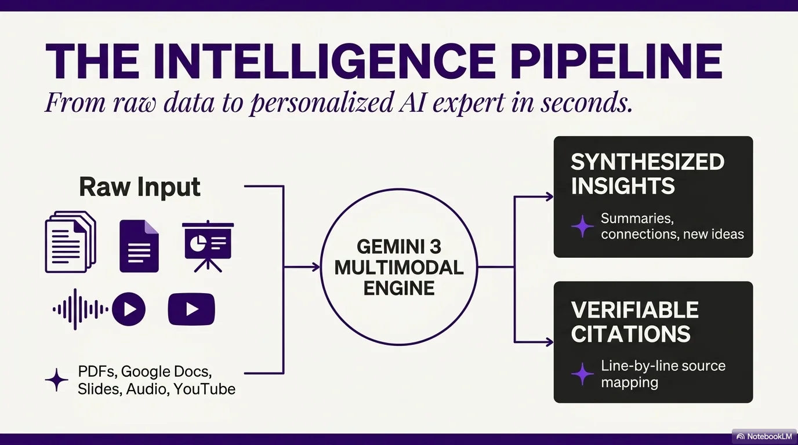

> [!TIP]
> This is a simplified preview. [View Full YAML](styles/creative_spark.yaml)

```yaml
design_system:
  global_style:
    theme: "Vibrant, creative, and high-impact. Dark canvas with neon purple accents."
    typography: 
      primary_heading: "Bold heavy sans-serif (e.g., Montserrat Black)"
      accent_heading: "Elegant cursive script (e.g., Great Vibes)"
      body_text: "Clean modern sans-serif"
    color_palette:
      primary_color: "#B18CFF"
      background: "#0F0F0F"
      text_main: "#FFFFFF"
    key_visual_elements: 
      - "Four-pointed sparkle icons"
      - "Thick vertical color blocks on edges"
      - "High-contrast tables"

slide_layout_templates:
  - type: "Cover_Spark"
    usage: "High-impact opening slide"
  - type: "Stitched_Portfolio"
    usage: "Showcasing multiple works or images"
  - type: "Impact_Results_Table"
    usage: "Presenting data with high contrast"
```

#### Artisan Rust

Warm, handcrafted, and organic design. Uses a textured rust-colored background with hand-drawn white doodles and tall condensed typography for an artisan feel.

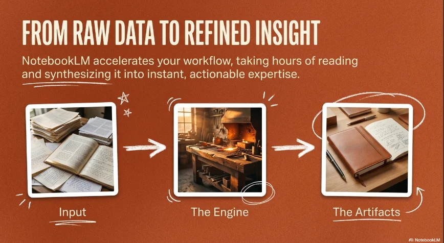

> [!TIP]
> This is a simplified preview. [View Full YAML](styles/artisan_rust.yaml)

```yaml
design_system:
  global_style:
    theme: "Warm, handcrafted, and organic. Textured rust canvas with hand-drawn doodles."
    typography: 
      primary_heading: "Tall condensed sans-serif (e.g., Anton)"
      secondary_heading: "Clean minimal sans-serif"
      body_text: "Functional sans-serif"
    color_palette:
      primary_color: "#FFFFFF"
      background: "#B34D2E"
      text_main: "#F5F5DC"
    key_visual_elements: 
      - "Hand-drawn white doodles"
      - "Grainy paper texture"
      - "Sticker-style image cutouts"

slide_layout_templates:
  - type: "Artisan_Portfolio"
    usage: "Showcasing projects with a handcrafted vibe"
  - type: "Process_Timeline"
    usage: "Visualizing steps or history"
  - type: "Sticker_Callout"
    usage: "Focusing on a specific person or object"
```

#### Vintage Charm

Romantic, nostalgic, and layered design inspired by coquette and scrapbooking aesthetics. It uses pastel tones, torn paper textures, and elegant accents like bows and pearls for a high-jewelry, vintage feel.

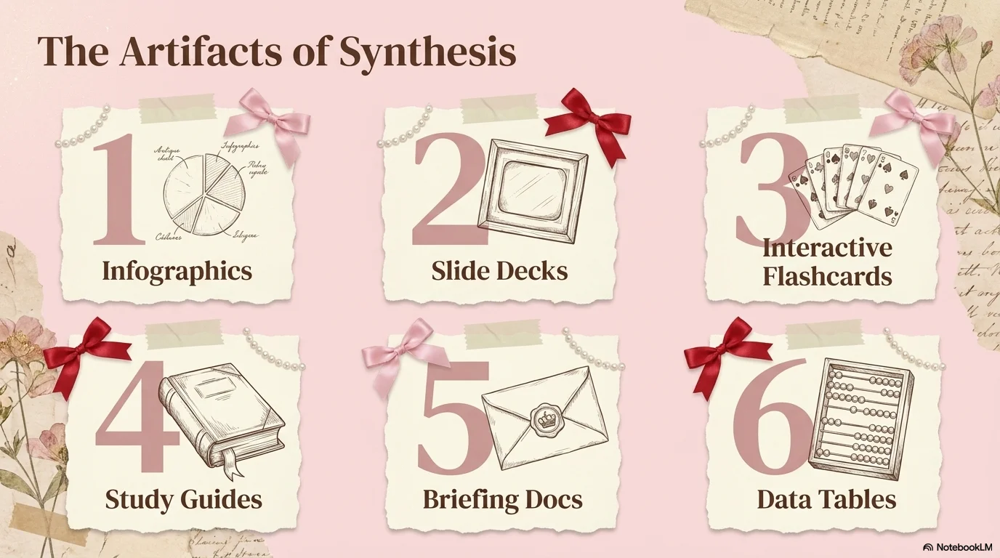

> [!TIP]
> This is a simplified preview. [View Full YAML](styles/vintage_charm.yaml)

```yaml
design_system:
  global_style:
    theme: "Romantic, nostalgic, and layered. Vintage scrapbook aesthetic."
    typography: 
      primary_heading: "Elegant vintage serif (e.g., Playfair Display)"
      secondary_heading: "Soft serif or clean traditional sans"
      body_text: "Functional serif with a classic feel"
    color_palette:
      primary_color: "#E67E7E"
      background: "#F8E1E1"
      text_main: "#4A3B3B"
      accent_color: "#D2C1A5"
    key_visual_elements: 
      - "Pink/Red ribbons and bows"
      - "Torn paper edges and layered textures"
      - "Vintage illustrations (floral/portraits)"
      - "Washi tape and pearls"

slide_layout_templates:
  - type: "Scrapbook_Header"
    usage: "Dynamic intro or section transitions"
  - type: "Layered_Referents"
    usage: "Showcasing aesthetic or historical references"
  - type: "Numbered_Vintage_Grid"
    usage: "Listing steps, characteristics, or points"
```

#### Creative Notebook

A clean, academic yet playful design inspired by creative journals and student notebooks. It features a graph paper grid background, organic pastel blobs in peach and blue, and numbered list elements for a highly organized yet aesthetic presentation feel.

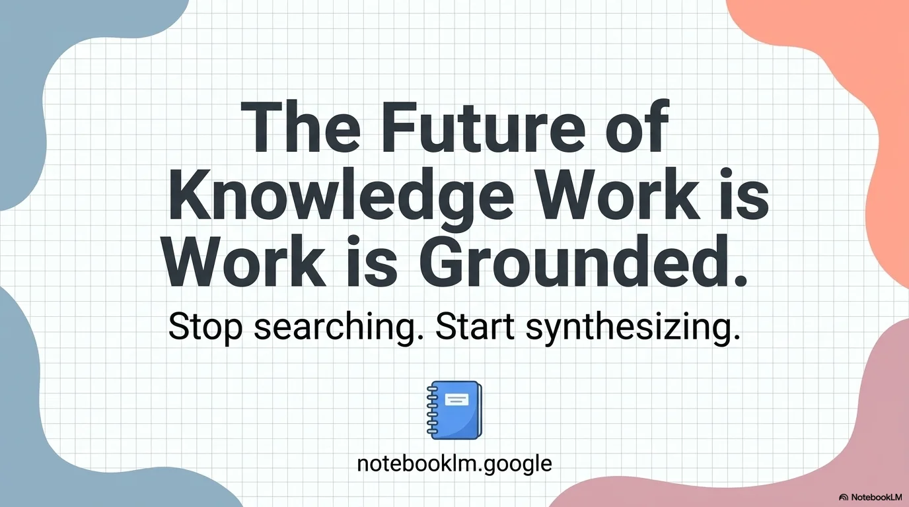

> [!TIP]
> This is a simplified preview. [View Full YAML](styles/creative_notebook.yaml)

```yaml
design_system:
  global_style:
    theme: "Creative, academic-journalistic, and organized. Scrapbook aesthetic with grid textures and organic pastel shapes."
    typography: 
      primary_heading: "Bold, clean sans-serif, primarily sentence case"
      secondary_heading: "Medium weight sans-serif"
      body_text: "Clean, highly legible sans-serif, airy spacing"
    color_palette:
      primary_color: "#FAD9C5"
      background: "White with light gray grid and organic pastel blobs"
      text_main: "#333333"
      accent_color: "#D1E3E9"
    key_visual_elements: 
      - "Graph paper/grid background pattern"
      - "Organic pastel blobs (Peach, Blue, Pink)"
      - "Numbered list items in colored circles"
      - "Post-it note elements with paperclips"

slide_layout_templates:
  - type: "Cover_Journal"
    usage: "Impactful intro with grid and organic framing"
  - type: "Horizontal_Cards"
    usage: "Presenting mission, vision, or core objectives"
  - type: "Sticker_Note_Split"
    usage: "Idea origin or highlighted conceptual points"
```

#### Kawaii Playful

Playful, friendly, and ultra-cute 'Kawaii' aesthetic. Combines soft pastel colors with chubby cat character illustrations, hand-drawn stars, and notebook-style grid backgrounds.

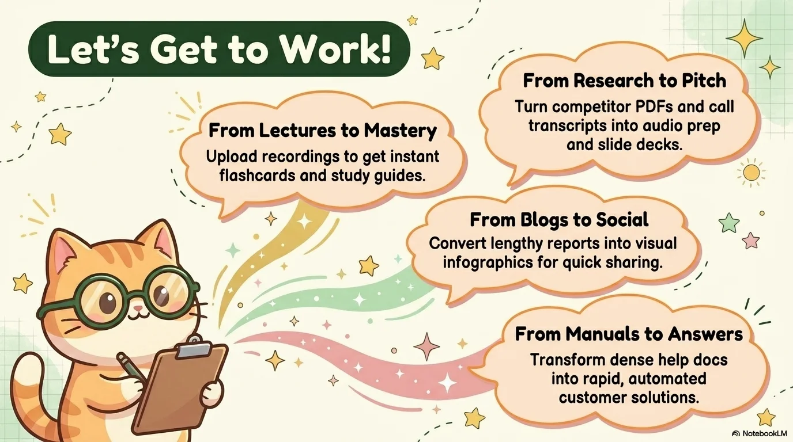

> [!TIP]
> This is a simplified preview. [View Full YAML](styles/kawaii_playful.yaml)

```yaml
design_system:
  global_style:
    theme: "Playful, friendly, and ultra-cute 'Kawaii' aesthetic."
    typography: 
      primary_heading: "Super-bold rounded bubble font (e.g., DynaPuff)"
      secondary_heading: "Clean, rounded sans-serif"
      body_text: "Friendly rounded sans-serif"
    color_palette:
      primary_color: "#4B6B4C"
      background: "#F7F8E0"
      accent_rose: "#F48FB1"
    key_visual_elements: 
      - "Chibi/Kawaii cat character illustrations"
      - "Subtle green notebook-style grid patterns"
      - "Pill-shaped containers for labels"
      - "Hand-drawn doodles (stars, sparkles)"

slide_layout_templates:
  - type: "Creative_Brainstorm"
    usage: "Opening slide for workshops"
  - type: "Strategic_Play"
    usage: "Outlining goals or objectives"
```

#### Y2K Nostalgia

Bubblegum pop, iridescent textures, and early digital nostalgia. Features CD-ROM reflections, fluffy clouds, and 3D 'plastic' icons (gummy bears, hearts, cupids) on pastel gradients.

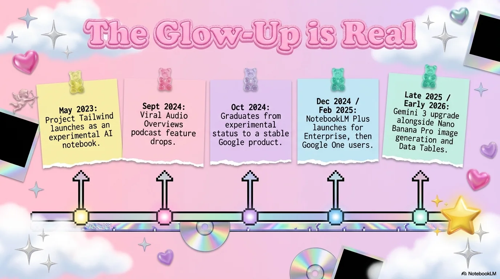

> [!TIP]
> This is a simplified preview. [View Full YAML](styles/y2k_nostalgia.yaml)

```yaml
design_system:
  global_style:
    theme: "Retro Digital. Bubblegum & Holographic."
    typography: 
      primary_heading: "Bold quirky block letters"
      secondary_heading: "Pixellated or typewriter monospace"
      body_text: "Clean legible monospace (e.g., Courier New)"
    color_palette:
      primary_color: "#FF85A1"
      background: "#FDEFF4"
      accent_purple: "#B19CD9"
    key_visual_elements: 
      - "CD-ROM rainbow reflections"
      - "Holographic/Iridescent textures"
      - "3D plastic gummy bears and icons"
      - "Polaroid photo frames"

slide_layout_templates:
  - type: "Pop_Culture_Hero"
    usage: "Dynamic titles or mood setters"
  - type: "Digital_Dairy"
    usage: "Storytelling or personal anecdotes"
  - type: "Memory_Gallery"
    usage: "Photos or event highlights"
```

#### Creative Workshop

Artistic, youthful, and workshop-oriented design. Features notebook grid backgrounds, pastel pink wavy accents, and friendly 2D art supply doodles (pencils, rainbows, stars).

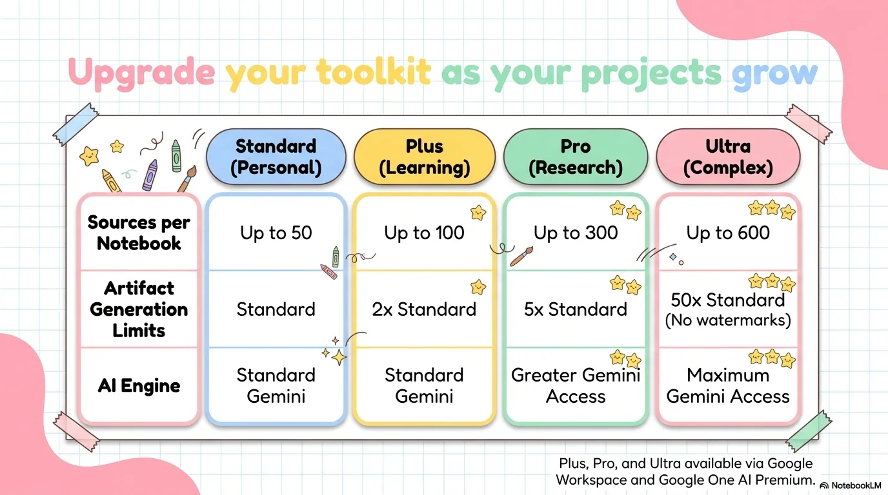

> [!TIP]
> This is a simplified preview. [View Full YAML](styles/creative_workshop.yaml)

```yaml
design_system:
  global_style:
    theme: "Art Studio. Creative & Playful."
    typography: 
      primary_heading: "Bold blocky sans-serif (Multi-color)"
      secondary_heading: "Rounded friendly sans-serif"
      body_text: "Clean legible sans-serif"
    color_palette:
      primary_color: "#F48FB1"
      background: "#FFFFFF"
      grid_lines: "#E1F5FE"
    key_visual_elements: 
      - "Ruled background textures"
      - "Organic wavy pink blobs"
      - "Smiling art supply illustrations"
      - "Pill-shaped category tags"

slide_layout_templates:
  - type: "Workshop_Hero"
    usage: "Project titles or starters"
  - type: "Activity_Grid"
    usage: "Listing activities or topics"
  - type: "Showcase_Gallery"
    usage: "Highlighting events or work"
```

#### Creative Classroom

Playful, warm, and educational design. Inspired by primary school classrooms and hand-drawn doodle aesthetics. Features soft cream backgrounds, chalkboard content frames, and flat 2D illustrations of classroom objects.

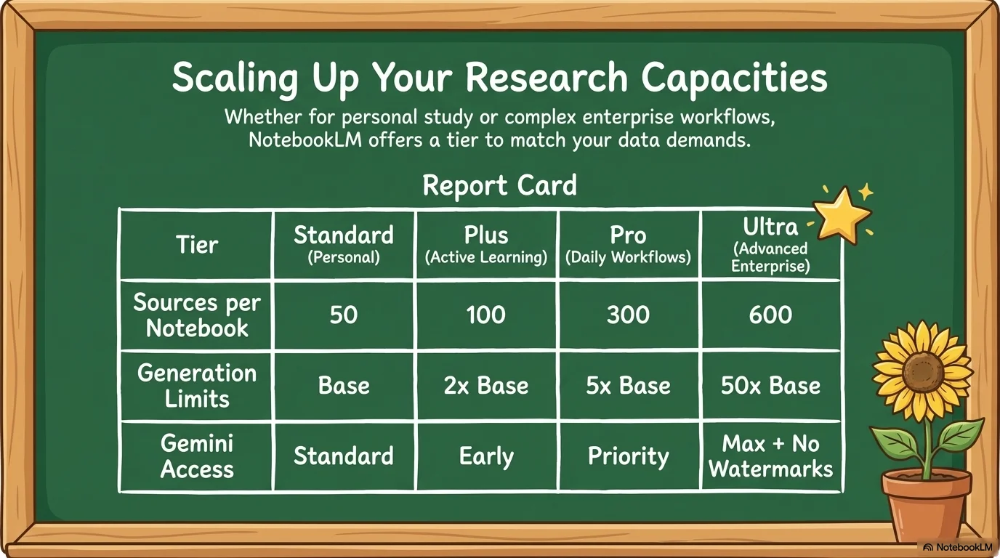

> [!TIP]
> This is a simplified preview. [View Full YAML](styles/creative_classroom.yaml)

```yaml
design_system:
  global_style:
    theme: "Playful educational. Classroom & Doodles."
    typography: 
      primary_heading: "Hand-drawn bold sans-serif (e.g., Fredoka One)"
      secondary_heading: "Rounded friendly sans-serif"
      body_text: "Clean legible sans-serif"
    color_palette:
      primary_color: "#557A68"
      background: "#FFF9E6"
      accent_wood: "#C4A484"
    key_visual_elements: 
      - "Chalkboard-themed content frames"
      - "Flat, 2D vector illustrations (globes, books)"
      - "ABC alphabet blocks"
      - "Irregular hand-drawn edges"

slide_layout_templates:
  - type: "Classroom_Hero"
    usage: "Main title or module introductions"
  - type: "Informational_Board"
    usage: "Core lesson content or discussion"
  - type: "Object_Focus_Detail"
    usage: "Summaries or conceptual focuses"
```


#### Hand-Drawn Scrapbook

A whimsical, Kawaii-inspired aesthetic characterized by soft pastel palettes, hand-drawn stickers, and a playful gingham grid. Perfect for educational projects, creative journals, or friendly presentations.

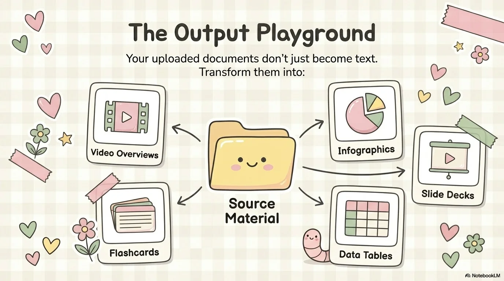

> [!TIP]
> This is a simplified preview. [View Full YAML](styles/hand_drawn_scrapbook.yaml)

```yaml
description: "A whimsical, Kawaii-inspired aesthetic characterized by soft pastel palettes, hand-drawn stickers, and a playful gingham grid. Perfect for educational projects, creative journals, or friendly presentations."
design_system:
  global_style:
    theme: "Whimsical, Kawaii-inspired aesthetic. Soft pastel palettes, hand-drawn stickers, and a playful gingham grid."
    typography: 
      primary_heading: "Baloo Thambi 2, display"
      secondary_heading: "Rounded friendly sans-serif"
      body_text: "Inter, sans-serif"
    color_palette:
      primary_color: "#A2B276"
      background: "#FDFCF0"
      accent_pink: "#F9A8A8"
      accent_yellow: "#F9D97D"
      text_main: "#4A4A4A"
    key_visual_elements: 
      - "Subtle gingham grid in pastel hues"
      - "Doodle flowers, Soft hearts, Friendly worm"
      - "Washi tape ribbon banners"
      - "Hand-drawn, slightly irregular strokes"

  image_generation_prompts:
    style_guidelines: "Whimsical hand-drawn illustrations, flat vector art, sticker aesthetic, Kawaii style, pastel colors, 2D illustration."
    themes:
      - target: "Creative Student"
        prompt_elements: "A person writing in a colorful journal with stickers and doodles, flat vector art."

slide_layout_templates:
  - type: "Sticker_Hero"
    usage: "Title slide with floating decorative elements and center title"
  - type: "Washi_Team"
    usage: "Team members showcased with ribbon-style name tags"
  - type: "Doodle_Grid"
    usage: "Content organized in rounded 'bento' boxes with hand-drawn borders"
```


#### Whimsical Animation

A sophisticated, animation-inspired portfolio aesthetic. It features a lush palette of forest and lime greens, modern geometric typography, and painterly gouache textures. Ideal for creative professionals looking for a whimsical yet high-end presentation style.

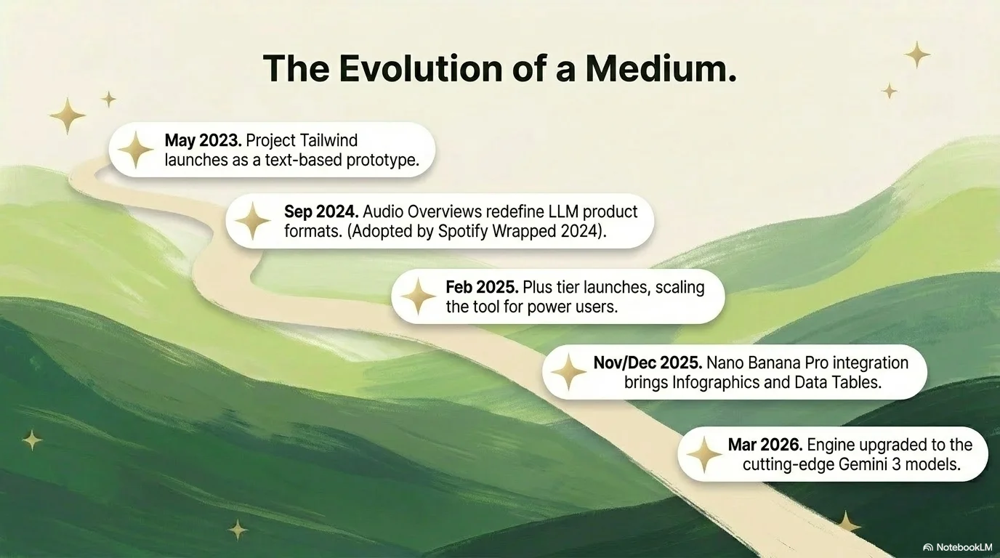

> [!TIP]
> This is a simplified preview. [View Full YAML](styles/whimsical_animation.yaml)

```yaml
description: "A sophisticated, animation-inspired portfolio aesthetic. It features a lush palette of forest and lime greens, modern geometric typography, and painterly gouache textures. Ideal for creative professionals looking for a whimsical yet high-end presentation style."
design_system:
  global_style:
    theme: "Whimsical Animation Portfolio. Organic greens, painterly textures, and modern geometric shapes."
    typography: 
      primary_heading: "TT Firs Neue, sans-serif"
      secondary_heading: "Medium weight geometric sans-serif"
      body_text: "Clean, high-legibility sans-serif"
    color_palette:
      primary: "#4A7C59" # Forest Green
      secondary: "#DCE6A3" # Lime Mist
      accent: "#FFD700" # Golden Star
      background: "#F1F5E1" # Soft Cream
      text_main: "#1A1A1A"
      surface: "#FFFFFF"
    key_visual_elements: 
      - "Painterly gouache-style background textures"
      - "Heavy rounded corners (pill-shaped containers)"
      - "Minimalist celestial accents (small four-pointed stars)"
      - "Soft irregular cloud shapes with dry-brush edges"

  image_generation_prompts:
    style_guidelines: "Gouache painting style, soft painterly textures, nature-inspired abstract backgrounds, stylized hills and clouds, soft lighting, professional creative portfolio aesthetic, TT Firs Neue font vibe."
    themes:
      - target: "Abstract Nature"
        prompt_elements: "Minimalist stylized hills and soft clouds in shades of green and lime, gouache texture, artistic composition."
      - target: "Creative Focus"
        prompt_elements: "Abstract geometric shapes with hand-painted textures, soft sage and forest green tones, minimalist stars."

slide_layout_templates:
  - type: "Animation_Hero"
    usage: "Main portfolio title with large pill-shaped heading container"
  - type: "Painterly_Grid"
    usage: "Project showcase using rounded bento-style blocks with textured backgrounds"
  - type: "Celestial_Process"
    usage: "Workflow steps marked with small minimalist star accents"
```


#### Clinical Doodles

An approachable and empathetic medical aesthetic inspired by hand-drawn nursing journals. It features the playful Schoolbell handwriting font, a soft pastel blue palette, and a subtle grid paper texture. Characterized by charming doodle illustrations and organic cloud-like shapes, it humanizes clinical topics.


> [!TIP]
> This is a simplified preview. [View Full YAML](styles/clinical_doodles.yaml)

```yaml
description: "An approachable and empathetic medical aesthetic inspired by hand-drawn nursing journals. It features the playful Schoolbell handwriting font, a soft pastel blue palette, and a subtle grid paper texture. Characterized by charming doodle illustrations and organic cloud-like shapes, it humanizes clinical topics."
design_system:
  global_style:
    theme: "Clinical Doodles. Warm, hand-drawn medical aesthetic with a scrapbook feel."
    typography: 
      primary_heading: "Schoolbell, cursive"
      secondary_heading: "Schoolbell, regular"
      body_text: "Schoolbell, regular"
    color_palette:
      primary: "#1E3A8A" # Navy Outline
      secondary: "#F87171" # Warm Coral Accent
      background: "#E0F2FE" # Soft Sky Blue
      surface: "#FFFFFF" # Paper Surface
      text_main: "#1E293B"
      text_secondary: "#475569"
    key_visual_elements: 
      - "Subtle grid paper background pattern"
      - "Hand-drawn 'doodle' illustrations of medical staff"
      - "Organic blob and cloud-like containers"
      - "Decorative swirls and hand-drawn arrows"

  image_generation_prompts:
    style_guidelines: "Hand-drawn illustration style, colored pencil texture, soft clinical themes, friendly characters, pastel blue and navy color palette, scrapbook aesthetic, Schoolbell font vibe."
    themes:
      - target: "Nursing Care"
        prompt_elements: "A friendly hand-drawn illustration of a nurse helping an elderly patient, soft colors, clinical but warm atmosphere, doodle style."
      - target: "Medical Agenda"
        prompt_elements: "A hand-drawn desk with medical tools and an agenda, doodle style, soft blue and white colors, grid paper background."

slide_layout_templates:
  - type: "Doodle_Cover"
    usage: "Title in hand-drawn clouds with medical staff illustrations surrounding it"
  - type: "Grid_Content"
    usage: "Bullet points on a grid paper background with decorative swirls"
  - type: "Scrapbook_Image"
    usage: "Image contained in an organic hand-drawn frame with a small coral accent"
  - type: "Medical_Timeline_Doodle"
    usage: "A wavy line timeline with hand-drawn icons and nursing characters"
```


#### Medicine Pop

A vibrant and high-energy medical aesthetic inspired by pop-art and modern vector illustrations. It features the bold Luktao typeface, a striking palette of deep purple, lavender, and energetic orange over a soft cream background. Characterized by playful medical icons and colorful 'plus' symbols, it brings a fresh and optimistic approach to healthcare data.

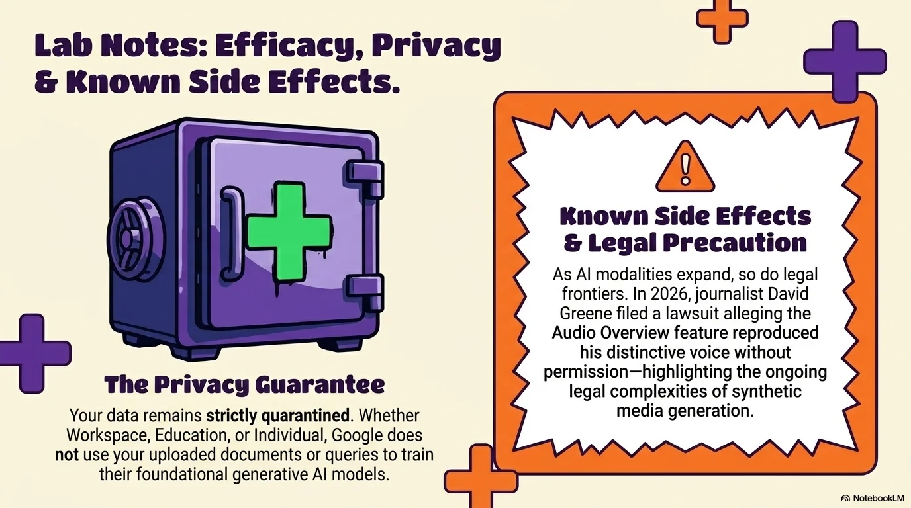

> [!TIP]
> This is a simplified preview. [View Full YAML](styles/medicine_pop.yaml)

```yaml
description: "A vibrant and high-energy medical aesthetic inspired by pop-art and modern vector illustrations. It features the bold Luktao typeface, a striking palette of deep purple, lavender, and energetic orange over a soft cream background. Characterized by playful medical icons and colorful 'plus' symbols, it brings a fresh and optimistic approach to healthcare data."
design_system:
  global_style:
    theme: "Medicine Pop. High-energy medical illustration style with vibrant purple and orange tones."
    typography: 
      primary_heading: "Luktao, sans-serif"
      secondary_heading: "Luktao, regular"
      body_text: "Poppins, medium" # Complemented with Poppins for body readability
    color_palette:
      primary: "#5B10A3" # Deep Purple
      secondary: "#FFAD33" # Energy Orange
      background: "#FFFBF0" # Soft Cream
      surface: "#F3E8FF" # Lavender Surface
      text_main: "#2D0A4E"
      text_secondary: "#5B10A3"
    key_visual_elements: 
      - "Vibrant flat illustrations of medical objects (pills, monitors, etc.)"
      - "Large colorful 'plus' icons (+) scattered as accents"
      - "Bold, saturated color blocks for data and charts"
      - "Playful and rounded layout shapes"

  image_generation_prompts:
    style_guidelines: "Vibrant vector illustration, pop-art medical style, saturated colors (purple, orange), soft cream background, playful characters and objects, clean bold lines, Luktao font vibe."
    themes:
      - target: "Medical Statistics"
        prompt_elements: "Colorful bar charts and icons, medical icons (heart, pill), vibrant purple and orange palette, energetic aesthetic."
      - target: "Innovative Lab"
        prompt_elements: "A laboratory with colorful test tubes and purple lighting, pop-art style illustration, vibrant and modern atmosphere."

slide_layout_templates:
  - type: "Pop_Medical_Cover"
    usage: "Large title on cream background surrounded by colorful medical doodles and orange crosses"
  - type: "Vibrant_Statistics"
    usage: "Full purple background slide with white cards for high-contrast data visualization"
  - type: "Timeline_Pop"
    usage: "A thick purple vertical line with orange markers and colorful icons for each milestone"
  - type: "Team_Doodles"
    usage: "Round portraits with thick colorful borders and name labels in Luktao font"
```


#### Garden Doodles

A cozy and organic hand-drawn aesthetic inspired by nature and garden sketches. It features the friendly Mali typeface and a warm palette of terracotta, sage green, and chocolate brown over a soft beige background. Characterized by charming 'doodle' illustrations like smiling suns, flowers, and wooden fences, it brings a personal and approachable touch to any presentation.

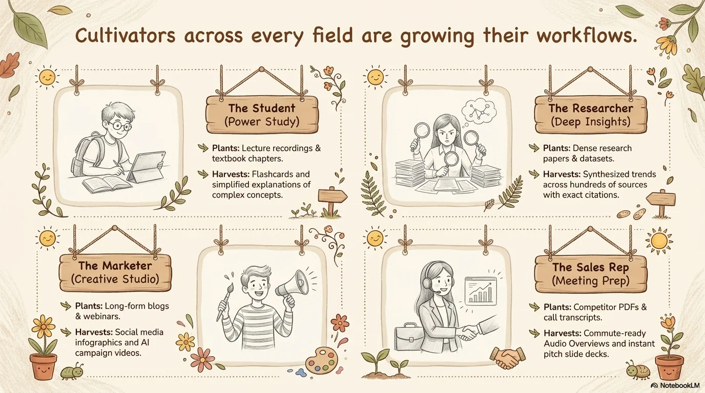

> [!TIP]
> This is a simplified preview. [View Full YAML](styles/garden_doodles.yaml)

```yaml
description: "A cozy and organic hand-drawn aesthetic inspired by nature and garden sketches. It features the friendly Mali typeface and a warm palette of terracotta, sage green, and chocolate brown over a soft beige background. Characterized by charming 'doodle' illustrations like smiling suns, flowers, and wooden fences, it brings a personal and approachable touch to any presentation."
design_system:
  global_style:
    theme: "Garden Doodles. Hand-drawn nature style with warm earth tones and friendly sketches."
    typography: 
      primary_heading: "Mali, sans-serif"
      secondary_heading: "Mali, medium"
      body_text: "Mali, regular"
    color_palette:
      primary: "#4B3D33" # Chocolate Brown
      secondary: "#D47C6A" # Terracotta
      background: "#F2E8DF" # Soft Beige
      surface: "#FAF3ED" # Light Cream Surface
      text_main: "#4B3D33"
      text_secondary: "#7A6C5D"
    key_visual_elements: 
      - "Hand-drawn 'doodle' illustrations of suns, plants, and flowers"
      - "Soft rounded corners for all containers and cards"
      - "Organic accent shapes like leaves and stars floating as background elements"
      - "Dotted lines and hand-drawn arrows for connectors"

  image_generation_prompts:
    style_guidelines: "Hand-drawn doodle illustration, warm earth tones, children's book aesthetic, soft pencil textures, organic shapes, friendly and cozy atmosphere, Mali font vibe."
    themes:
      - target: "Nature Elements"
        prompt_elements: "Smiling sun, garden flowers, and green leaves in a cute doodle style, soft beige background, terracotta accents."
      - target: "Project Timeline"
        prompt_elements: "A hand-drawn ladder with vines, earthy colors, organic and playful layout, cozy garden vibe."

slide_layout_templates:
  - type: "Garden_Cover"
    usage: "Large title in Mali font on a beige background with a smiling sun and flowers in the corners"
  - type: "Doodle_Team"
    usage: "Portrait photos inside soft rounded frames with hand-drawn name labels below"
  - type: "Organic_Timeline"
    usage: "A dotted horizontal line connecting colorful hand-drawn circles with event text"
  - type: "Resource_Garden"
    usage: "A collage of garden icons (watering cans, plants, trees) acting as a background for resource links"
```


#### Kawaii Storybook

An adorable and high-contrast Kawaii aesthetic inspired by children's storybooks. It features the chunky and playful More Sugar typeface over a bright sky blue and meadow green landscape. Characterized by super-cute animal characters (chicks, rabbits, elephants) with rosy cheeks and smiling clouds, it creates a joyful and innocent atmosphere for any presentation.

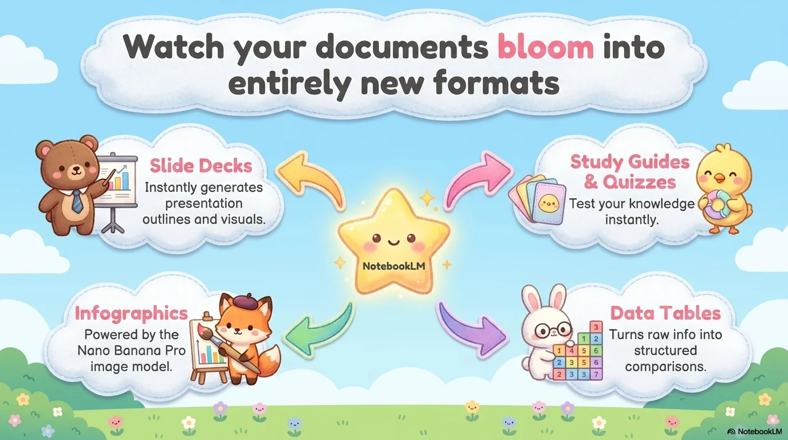

> [!TIP]
> This is a simplified preview. [View Full YAML](styles/kawaii_storybook.yaml)

```yaml
description: "An adorable and high-contrast Kawaii aesthetic inspired by children's storybooks. It features the chunky and playful More Sugar typeface over a bright sky blue and meadow green landscape. Characterized by super-cute animal characters (chicks, rabbits, elephants) with rosy cheeks and smiling clouds, it creates a joyful and innocent atmosphere for any presentation."
design_system:
  global_style:
    theme: "Kawaii Storybook. Ultra-cute animal illustration style with bright pastel tones."
    typography: 
      primary_heading: "More Sugar, sans-serif"
      secondary_heading: "More Sugar, regular"
      body_text: "Quicksand, medium" # Complemented with Quicksand for a soft rounded body feel
    color_palette:
      primary: "#34495E" # Charcoal Text
      secondary: "#FFB7C5" # Cherry Blossom Pink
      background: "#D1F2FF" # Bright Sky Blue
      surface: "#FFFFFF" # Pure White Cloud Surface
      text_main: "#34495E"
      text_secondary: "#5D6D7E"
    key_visual_elements: 
      - "Super-cute (Kawaii) animal illustrations with simple faces and rosy cheeks"
      - "Bright sun and clouds with smiling faces"
      - "Meadow green bottom border with small flowers"
      - "Soft, patchwork or felt-like textures on illustrations"

  image_generation_prompts:
    style_guidelines: "Kawaii animal illustration, pastel colors, children's storybook style, thick rounded lines, smiling faces on everything, rosy cheeks, felt texture look, More Sugar font vibe."
    themes:
      - target: "Project Overview"
        prompt_elements: "Cute blue elephant and a pink pacifier illustration, soft sky blue background, Kawaii aesthetic, innocent and joyful."
      - target: "Success Analysis"
        prompt_elements: "A happy chick wearing a party hat next to a colorful bar chart, Kawaii style, bright and cheerful colors."

slide_layout_templates:
  - type: "Kawaii_Cover"
    usage: "Title in More Sugar font centered on a white cloud, surrounded by a smiling sun, rabbit, and chick"
  - type: "Story_Landscape"
    usage: "Text placed on a large white central bubble with a sky blue top and green grass bottom full of animals"
  - type: "Character_Points"
    usage: "Bullet points where each point is introduced by a different Kawaii animal"
  - type: "Thank_You_Story"
    usage: "Large 'Thank You' with all characters waving from the corners of the slide"
```


#### Biochemical Doodles

A creative and educational scientific aesthetic that blends modern biology with hand-drawn doodles. It features the tactile Bobby Jones typeface over a subtly textured paper background. Characterized by charming sketches of DNA helices, beakers, molecules, and organic fluid shapes in muted wine and sage tones, it brings a curious and experimental spirit to any presentation.

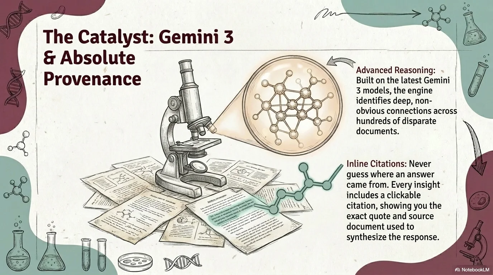

> [!TIP]
> This is a simplified preview. [View Full YAML](styles/biochemical_doodles.yaml)

```yaml
description: "A creative and educational scientific aesthetic that blends modern biology with hand-drawn doodles. It features the tactile Bobby Jones typeface over a subtly textured paper background. Characterized by charming sketches of DNA helices, beakers, molecules, and organic fluid shapes in muted wine and sage tones, it brings a curious and experimental spirit to any presentation."
design_system:
  global_style:
    theme: "Biochemical Doodles. Hand-drawn scientific illustration style with muted organic tones."
    typography: 
      primary_heading: "Bobby Jones, sans-serif"
      secondary_heading: "Bobby Jones, regular"
      body_text: "Sniglet, regular" # Complemented with Sniglet for a friendly rounded body feel
    color_palette:
      primary: "#6D435A" # Deep Wine Maroon
      secondary: "#92B4B1" # Sage Teal
      background: "#F9F7F2" # Textured Paper White
      surface: "#E8E4D9" # Dusty Stone Surface
      text_main: "#4A2D3C"
      text_secondary: "#6D435A"
    key_visual_elements: 
      - "Hand-drawn scientific sketches (beakers, DNA, cells, molecules)"
      - "Fluid, organic background blobs in muted colors"
      - "Subtle paper grain or fiber texture throughout the slides"
      - "Rustic, hand-drawn dividers and icons"

  image_generation_prompts:
    style_guidelines: "Hand-drawn scientific illustration, muted wine and sage color palette, textured paper background, organic fluid shapes, pencil and ink sketches, experimental and curious atmosphere, Bobby Jones font vibe."
    themes:
      - target: "Chemical Analysis"
        prompt_elements: "Sketches of molecules and beakers, organic fluid blobs in the background, muted colors, textured paper look."
      - target: "Biological Research"
        prompt_elements: "A hand-drawn DNA helix and microscopic cells, earthy tones, curious and scholarly aesthetic."

slide_layout_templates:
  - type: "Science_Project_Cover"
    usage: "Bold Bobby Jones title on textured paper with beakers and fluid shapes in the corners"
  - type: "Lab_Rules"
    usage: "Numbered list with hand-drawn beaker icons for each rule on a clean stone surface"
  - type: "Molecular_Diagram"
    usage: "A central molecule sketch with descriptive text boxes floating around it"
  - type: "Experimental_Timeline"
    usage: "A vertical line representing an experiment progress with hand-drawn icons at each stage"
```


#### Science Sketch

A clean and vibrant academic aesthetic inspired by high school science projects and textbook sketches. It features the hand-drawn Schoolbell typeface paired with the condensed Pompiere for subtitles. Characterized by thick-lined blue vector doodles filled with bright yellow, and accents like graph paper grids and wavy lines, it conveys a sense of organized learning and active discovery.

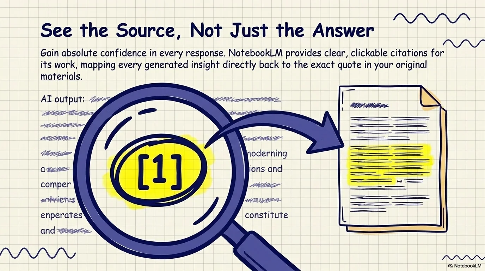

> [!TIP]
> This is a simplified preview. [View Full YAML](styles/science_sketch.yaml)

```yaml
description: "A clean and vibrant academic aesthetic inspired by high school science projects and textbook sketches. It features the hand-drawn Schoolbell typeface paired with the condensed Pompiere for subtitles. Characterized by thick-lined blue vector doodles filled with bright yellow, and accents like graph paper grids and wavy lines, it conveys a sense of organized learning and active discovery."
design_system:
  global_style:
    theme: "Science Sketch. Clean academic illustration style with bold blue and yellow tones."
    typography: 
      primary_heading: "Schoolbell, sans-serif"
      secondary_heading: "Pompiere, regular"
      body_text: "Schoolbell, regular"
    color_palette:
      primary: "#3F51B5" # Indigo Blue
      secondary: "#FFD54F" # Sunflower Yellow
      background: "#FFFDF0" # Light Cream
      surface: "#E3F2FD" # Sky Blue Surface
      text_main: "#283593"
      text_secondary: "#3F51B5"
    key_visual_elements: 
      - "Clean vector doodles with thick indigo outlines and yellow fills"
      - "Graph paper (grid) patterns in the corners or background"
      - "Wavy horizontal lines (sine waves) as decorative accents"
      - "Soft color blobs acting as backgrounds for key scientific icons"

  image_generation_prompts:
    style_guidelines: "Clean vector doodle, thick blue outlines, bright yellow highlights, cream background, graph paper textures, educational icons, Schoolbell font vibe."
    themes:
      - target: "Methodology"
        prompt_elements: "Microscope and test tubes in a clean vector style, indigo and yellow palette, academic and bright."
      - target: "Findings"
        prompt_elements: "A bar chart on a graph paper background, thick-lined doodles of a magnifying glass, vibrant educational aesthetic."

slide_layout_templates:
  - type: "Sketch_Cover"
    usage: "Large Schoolbell title with thick outlines, surrounded by atoms, books, and yellow wavy lines"
  - type: "Grid_Content"
    usage: "Text placed on a clean area with a subtle graph paper grid pattern in the background"
  - type: "Method_Focus"
    usage: "Central image with rounded corners and a thick border, surrounded by scientific doodles"
  - type: "Academic_Summary"
    usage: "Summary list where each item is marked by a small yellow filled indigo circle"
```


#### Athletic Energy

A vibrant and motivational aesthetic that celebrates sports and physical activity through a grainy, textured illustration style. It features the massive and blocky Gulfs Display typeface for high-impact headlines. Characterized by energetic salmon and mint green tones, and illustrations of athletes in motion over stippled backgrounds, it brings vitality and a youthful spirit to health and wellness presentations.

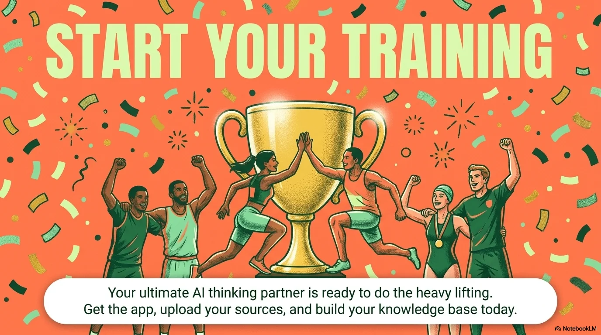

> [!TIP]
> This is a simplified preview. [View Full YAML](styles/athletic_energy.yaml)

```yaml
description: "A vibrant and motivational aesthetic that celebrates sports and physical activity through a grainy, textured illustration style. It features the massive and blocky Gulfs Display typeface for high-impact headlines. Characterized by energetic salmon and mint green tones, and illustrations of athletes in motion over stippled backgrounds, it brings vitality and a youthful spirit to health and wellness presentations."
design_system:
  global_style:
    theme: "Athletic Energy. Dynamic sports illustration style with grainy textures and bold blocky typography."
    typography: 
      primary_heading: "Gulfs Display, sans-serif"
      secondary_heading: "Gulfs Display, regular"
      body_text: "Inter, regular" # Complemented with Inter for modern readability
    color_palette:
      primary: "#FF7051" # Salmon Orange
      secondary: "#A5D6A7" # Mint Green
      background: "#F1F8E9" # Pale Lime Green
      surface: "#FFCDD2" # Soft Red Surface
      text_main: "#1B5E20" # Deep Forest Green for contrast
      text_secondary: "#FF7051"
    key_visual_elements: 
      - "Dynamic character illustrations in sports action poses (running, jumping)"
      - "Subtle stippling/noise texture on all colors and shapes"
      - "Red running track curves as a recurring background motif"
      - "Rounded white containers for body text to maintain legibility"

  image_generation_prompts:
    style_guidelines: "Dynamic sports illustration, grainy stippled texture, Gulfs Display font vibe, salmon and mint green color scheme, energetic and youthful atmosphere, soft airbrush shading."
    themes:
      - target: "Teamwork"
        prompt_elements: "Athletes high-fiving on a running track, grainy texture, vibrant colors, motivational sports aesthetic."
      - target: "Individual Achievement"
        prompt_elements: "A runner crossing a finish line, stippled effect, salmon and green palette, powerful and dynamic movement."

slide_layout_templates:
  - type: "Sports_Headline"
    usage: "Full-page Gulfs Display title in salmon over a textured sports scene"
  - type: "Action_Feature"
    usage: "Large action illustration on one side with a rounded text bubble on the other"
  - type: "Dynamic_Step"
    usage: "A sequence of athletes representing progress or steps in a process"
  - type: "Victory_Slide"
    usage: "Central trophy illustration with festive confetti doodles and a large 'Thank You' in Gulfs Display"
```


#### Kawaii Wellness

An ultra-cute and cheering aesthetic that makes fitness feel approachable and fun. It features the modern TT Firs Neue typeface against a whimsical pastel world. Characterized by adorable chubby characters (kawaii style) engaged in exercises, pink and yellow checkered patterns, and twinkling stars, it brings a sense of joy and sweetness to health and daily movement content.


> [!TIP]
> This is a simplified preview. [View Full YAML](styles/kawaii_wellness.yaml)

```yaml
description: "An ultra-cute and cheering aesthetic that makes fitness feel approachable and fun. It features the modern TT Firs Neue typeface against a whimsical pastel world. Characterized by adorable chubby characters (kawaii style) engaged in exercises, pink and yellow checkered patterns, and twinkling stars, it brings a sense of joy and sweetness to health and daily movement content."
design_system:
  global_style:
    theme: "Kawaii Wellness. Cute and whimsical pastel design for friendly fitness content."
    typography: 
      primary_heading: "TT Firs Neue, bold"
      secondary_heading: "TT Firs Neue, regular"
      body_text: "Sniglet, regular" # Friendly rounded body text
    color_palette:
      primary: "#F48FB1" # Pastel Pink
      secondary: "#FFF59D" # Pastel Yellow
      accent: "#81D4FA" # Pastel Blue
      background: "#FFFDF0" # Creamy White
      text_main: "#424242"
      text_secondary: "#F48FB1"
    key_visual_elements: 
      - "Chubby, kawaii characters performing fitness activities"
      - "Checkered patterns (pink/white or yellow/white)"
      - "Twinkling stars and sparkles as background decorations"
      - "Dashed-line containers and rounded bubble shapes"

  image_generation_prompts:
    style_guidelines: "Kawaii character design, pastel color palette, chubby white mochi-style characters, pink checkered patterns, cheerful and cute atmosphere, stars and sparkles."
    themes:
      - target: "Daily Workout"
        prompt_elements: "A cute round character lifting a tiny dumbbell, pastel pink background with stars, kawaii fitness style."
      - target: "Healthy Habits"
        prompt_elements: "Adorable characters sleeping and eating apples, yellow checkered border, whimsical and sweet wellness aesthetic."

slide_layout_templates:
  - type: "Kawaii_Wellness_Cover"
    usage: "Bold title surrounded by stars and a large illustration of an exercising mochi character"
  - type: "Bubble_Card"
    usage: "Text placed inside a soft-edged pink bubble with a cute character peeking from the side"
  - type: "Step_by_Step_Pastel"
    usage: "Sequential items marked by different pastel stars (pink, yellow, blue)"
  - type: "Checkered_Slide"
    usage: "Content area with a checkered pattern border and a large cheerful illustration"
```


#### Groovy 70s

A warm and nostalgic aesthetic inspired by the groovy 70s. It features the psychedelic and flowing TAN Nimbus serif for a highly stylized look. Characterized by a cream background with wavy rainbow stripes in burnt orange, mustard yellow, and teal, it uses retro sparkles, flower power icons, and organic heart shapes to create a soulful and stylish atmosphere.


> [!TIP]
> This is a simplified preview. [View Full YAML](styles/groovy_70s.yaml)

```yaml
description: "A warm and nostalgic aesthetic inspired by the groovy 70s. It features the psychedelic and flowing TAN Nimbus serif for a highly stylized look. Characterized by a cream background with wavy rainbow stripes in burnt orange, mustard yellow, and teal, it uses retro sparkles, flower power icons, and organic heart shapes to create a soulful and stylish atmosphere."
design_system:
  global_style:
    theme: "Groovy 70s. Nostalgic and psychedelic design with organic curves and warm retro tones."
    typography: 
      primary_heading: "TAN Nimbus, serif"
      secondary_heading: "TAN Nimbus, medium"
      body_text: "Inter, regular" # Using a clean sans for readability alongside the stylized headers
    color_palette:
      primary: "#BF360C" # Burnt Orange
      secondary: "#FBC02D" # Mustard Yellow
      background: "#E8DCC4" # Warm Cream / Beige
      surface: "#006064" # Teal / Dark Green
      text_main: "#212121" # Charcoal for contrast
      text_secondary: "#BF360C"
    key_visual_elements: 
      - "Wavy, multi-colored rainbow stripes flowing across the layout"
      - "Retro four-pointed star sparkles and flower power icons"
      - "Organic, hand-drawn heart shapes and floral motifs"
      - "Warm, low-contrast cream background that enhances retro tones"

  image_generation_prompts:
    style_guidelines: "70s groovy aesthetic, burnt orange and mustard yellow palette, wavy rainbow stripes, TAN Nimbus font vibe, retro sparkles and flowers, warm and nostalgic atmosphere."
    themes:
      - target: "Project Vision"
        prompt_elements: "A retro office with 70s furniture, warm sunlight, wavy orange and teal graphic overlays, groovy and stylish vibe."
      - target: "Creative Team"
        prompt_elements: "People in 70s vintage clothing, grainy film texture, flower power icons, warm and soulful atmosphere."

slide_layout_templates:
  - type: "Groovy_Cover"
    usage: "Large TAN Nimbus title on a cream background with wavy stripes flowing from the corner"
  - type: "Flower_Power_Points"
    usage: "Bullet points where each point is marked by a small retro flower icon"
  - type: "Wavy_Divider"
    usage: "A slide with a large horizontal wavy rainbow separating two sections of content"
  - type: "Retro_Sparkle_Quote"
    usage: "A centered quote surrounded by four-pointed star sparkles and heart motifs"
```

---


### 📖 Editorial & Magazine

#### Editorial Essence

Sophisticated, editorial, and human-centric design language. It uses warm cream backgrounds, bold terracotta accents, and elegant serif typography to create a "book-like" presentation feel.

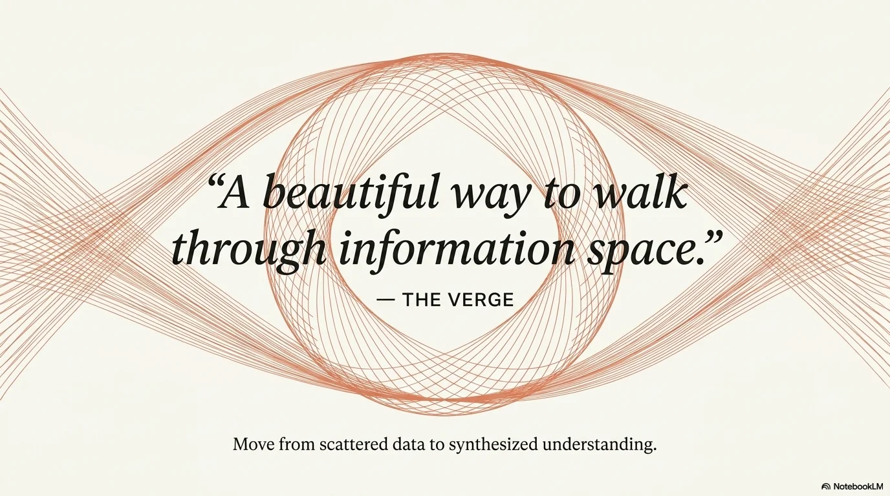

> [!TIP]
> This is a simplified preview. [View Full YAML](styles/editorial_essence.yaml)

```yaml
design_system:
  global_style:
    theme: "Minimalist, sophisticated, and human-centric. High-end editorial style using warm cream backgrounds and bold terracotta accents."
    typography: 
      primary_heading: "Elegant serif (e.g., Lora, Playfair Display), bold"
      secondary_heading: "Clean sans-serif (e.g., Poppins, Inter), uppercase"
      body_text: "Refined serif (e.g., Lora), airy line-height"
    color_palette:
      primary_color: "#D97757"
      background: "#FAF9F5"
      text_main: "#141413"
    key_visual_elements: 
      - "Generous whitespace (Editorial layout)"
      - "Abstract geometric line art"
      - "Pill-shaped labels"

  image_generation_prompts:
    style_guidelines: "Editorial photography style, warm natural lighting, high-end magazine aesthetic, minimalist cream background, terracotta accents."
    themes:
      - target: "Abstract Connection"
        prompt_elements: "Minimalist geometric shapes, warm earth tones, fine line art."

slide_layout_templates:
  - type: "Cover_Editorial"
    usage: "Main title slide with high-impact serif typography"
  - type: "Split_Insight"
    usage: "40/60 text-image split for conceptual explanations"
```

#### Luxury Editorial

A sophisticated, minimalist aesthetic inspired by high-end fashion magazines. It features a luxury palette of deep espresso and gold, combining elegant condensed serifs with flowing cursive accents. Ideal for luxury brands, fashion collections, and premium product launches.

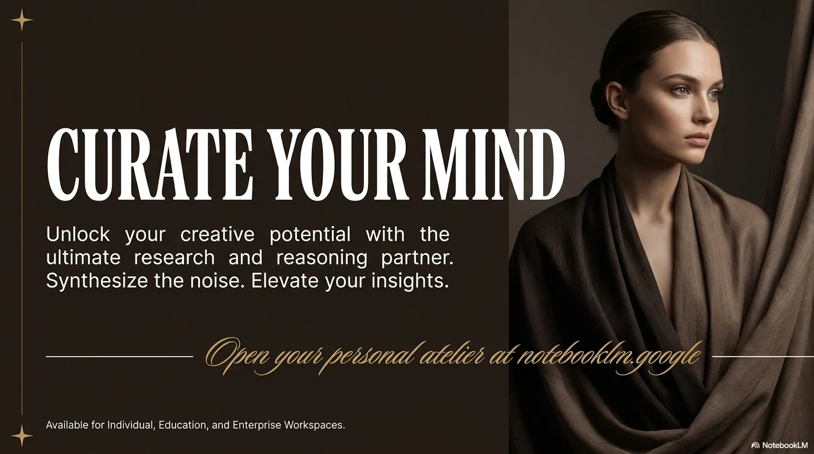

> [!TIP]
> This is a simplified preview. [View Full YAML](styles/luxury_editorial.yaml)

```yaml
design_system:
  global_style:
    theme: "High-end fashion magazine aesthetic. Deep espresso and gold."
    typography: 
      primary_heading: "Elegant condensed serif (Didot-style)"
      accent_script: "Refined flowing cursive"
      body_text: "Minimalist sans-serif with wide tracking"
    color_palette:
      primary_color: "#2D2926"
      secondary_color: "#D4AF37"
      background: "#3C2F2F"
      text_main: "#FFFFFF"
    key_visual_elements: 
      - "Subtle gold sparkle/star vector accents"
      - "Macro photography of luxury textures (silk, jewelry)"
      - "Asymmetric split-screen layouts"
      - "Overlaying script text on top of serif titles"

slide_layout_templates:
  - type: "Editorial_Cover"
    usage: "Fashion collection intro with full-bleed luxury imagery"
  - type: "Brand_Narrative"
    usage: "Split-screen layout for brand stories or mission"
  - type: "Visual_Lookbook"
    usage: "Grid-based display for styling ideas or products"
```

#### Cobalt Editorial

Bold editorial and Swiss-inspired design. High contrast between Electric Blue and Cream, featuring large brutalist typography, liquid organic textures, and iconic symbols like asterisks and plus signs.

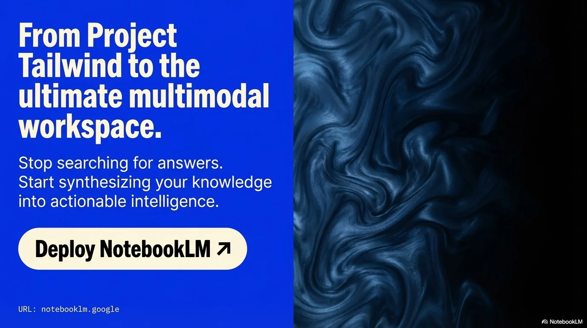

> [!TIP]
> This is a simplified preview. [View Full YAML](styles/cobalt_editorial.yaml)

```yaml
design_system:
  global_style:
    theme: "Bold editorial, Swiss-inspired. Electric Blue & Cream."
    typography: 
      primary_heading: "Extra-bold brutalist sans-serif (e.g., Inter)"
      secondary_heading: "Bold sans-serif, vertical layouts"
      body_text: "Clean sans-serif, high legibility"
    color_palette:
      primary_color: "#2B59FF"
      background: "#FDF5E6"
      text_main: "#000000"
    key_visual_elements: 
      - "Electric Blue asterisks (*) and plus signs (+)"
      - "Liquid, rippled, or smoky textures"
      - "Split-screen layouts"
      - "Pill-shaped buttons with blue outlines"

slide_layout_templates:
  - type: "Editorial_Split"
    usage: "Core sections or chapter starts"
  - type: "Vertical_Type_List"
    usage: "Detailed overviews or content lists"
  - type: "Modular_Brand_Focus"
    usage: "Presenting mission statements or pillars"
```

#### Architectural Portfolio

A modern, minimalist, and geometric design inspired by architectural blueprints and professional portfolios. It features complex pill-shaped photo masks, sage green accents, and a modular "Bento-grid" layout for a high-end, structured aesthetic.

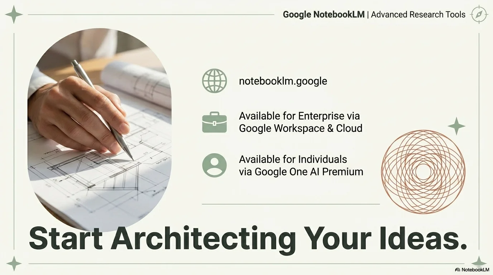

> [!TIP]
> This is a simplified preview. [View Full YAML](styles/architectural_portfolio.yaml)

```yaml
design_system:
  global_style:
    theme: "Modern architectural and geometric. Modular bento-grid layouts."
    typography: 
      primary_heading: "Bold geometric sans-serif (Montserrat/Inter)"
      secondary_heading: "Medium sans-serif, clean"
      body_text: "Light-weight minimalist sans-serif"
    color_palette:
      primary_color: "#8B9B7B"
      background: "Off-White (#F4F4F4)"
      text_main: "#333333"
      accent_color: "#A0522D"
    key_visual_elements: 
      - "Complex pill-shaped and circular photo masks"
      - "Modular Bento-grid content organization"
      - "Minimalist sage green star icons in corners"
      - "Thin horizontal separators and asymmetric clusters"

slide_layout_templates:
  - type: "Portfolio_Cover"
    usage: "Bold intro with complex geometric photo masking"
  - type: "Bento_Index"
    usage: "Modular TOC or overview with circular masks"
  - type: "Contact_Modular"
    usage: "Final contact info with terracotta accents"
```

#### Classical Gallery

A refined, museum-inspired design featuring parchment textures, sage green accents, and elegant ornamental filigree. It balances historical aesthetics with modern sans-serif typography for a scholarly and curated presentation feel.

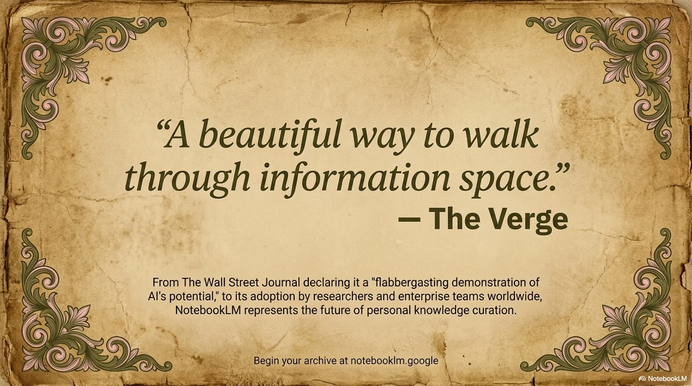

> [!TIP]
> This is a simplified preview. [View Full YAML](styles/classical_gallery.yaml)

```yaml
design_system:
  global_style:
    theme: "Classical museum-like, historical and refined. Parchment textures and elegant scrollwork."
    typography: 
      primary_heading: "Bold clean sans-serif for modern contrast"
      secondary_heading: "Medium weight sans-serif"
      body_text: "Highly legible sans-serif"
    color_palette:
      primary_color: "#8B9B7B"
      background: "Textured parchment (#E6E1D3)"
      text_main: "#4B5320"
      accent_color: "#F4C2C2"
    key_visual_elements: 
      - "Elegant ornamental filigree and scrollwork"
      - "Sage green color blocks for sidebars"
      - "Marble sculptures and Renaissance-style sketches"
      - "High-texture parchment background"

slide_layout_templates:
  - type: "Museum_Cover"
    usage: "Classical intro with symmetric filigree framing"
  - type: "Classical_Split"
    usage: "Art-focused layouts with large color blocks"
  - type: "Percentage_Highlight"
    usage: "Key metrics or summaries with historical framing"
```

#### Summer Collage

A bright, energetic, and sun-drenched design featuring asymmetric photo grids, breezy handwritten accents, and "Polaroid" style overlays. It creates a vibrant lifestyle atmosphere perfect for travel, leisure, and summer-themed presentations.

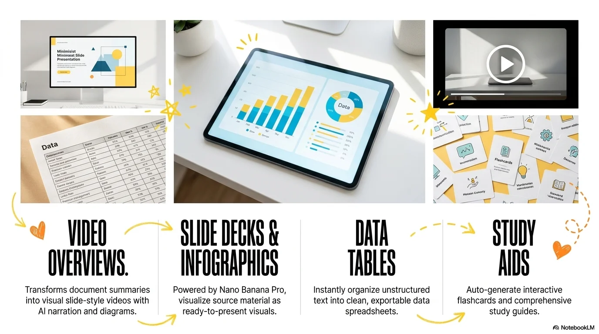

> [!TIP]
> This is a simplified preview. [View Full YAML](styles/summer_collage.yaml)

```yaml
design_system:
  global_style:
    theme: "Bright, energetic, and sun-drenched vacation vibe. Photo collages and handwritten accents."
    typography: 
      primary_heading: "Extra-tall, bold, condensed sans-serif"
      secondary_heading: "Elegant flowing script / handwritten font"
      body_text: "Clean minimalist sans-serif"
    color_palette:
      primary_color: "#00A8CC"
      background: "Pure White (#FFFFFF)"
      text_main: "#1A1A1A"
      accent_color: "#F4D03F"
    key_visual_elements: 
      - "Asymmetric photo grids and mosaics"
      - "Rotated 'Polaroid' style photo overlays"
      - "Hand-drawn doodle icons (hearts, arrows)"
      - "High-saturation lifestyle imagery"

slide_layout_templates:
  - type: "Vacation_Cover"
    usage: "High-impact mosaic intro with condensed typography"
  - type: "Polaroid_Memories"
    usage: "Reflective content with rotated photo frames"
  - type: "Condensed_Keyword"
    usage: "Bold section breaks or summary slides"
```

#### Vision Board

A tactile, handmade, and inspirational design featuring realistic paper textures, torn edges, and washi tape accents. It captures the essence of a physical scrapbook or mood board, perfect for creative workshops, personal planning, and visionary presentations.

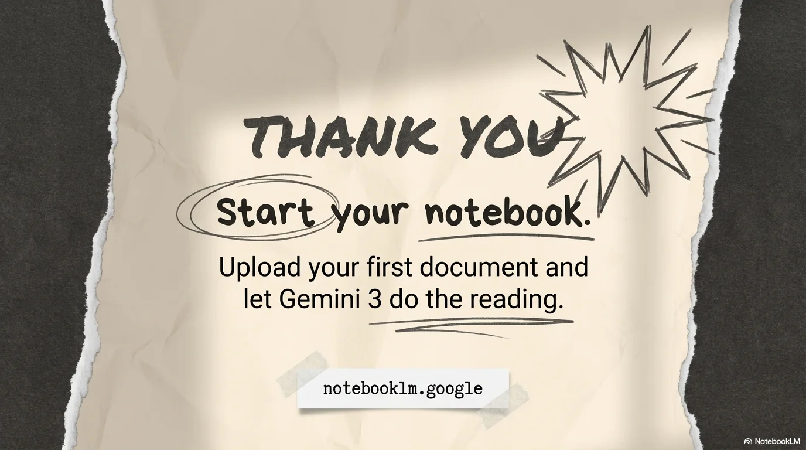

> [!TIP]
> This is a simplified preview. [View Full YAML](styles/vision_board.yaml)

```yaml
design_system:
  global_style:
    theme: "Tactile, handmade scrapbooking aesthetic. Torn edges, tape accents, and paper textures."
    typography: 
      primary_heading: "Extra-bold thick sans-serif (all caps)"
      secondary_heading: "Marker-style / handwritten font"
      body_text: "Clean professional sans-serif"
    color_palette:
      primary_color: "#F9F7F2"
      background: "Crumpled paper texture"
      text_main: "#2D2D2D"
      accent_color: "#E0E0E0"
    key_visual_elements: 
      - "Realistic torn paper edge overlays"
      - "Washi tape and masking tape strips"
      - "Hand-drawn marker ovals and arrows"
      - "Multi-layered paper scrap aesthetic"

slide_layout_templates:
  - type: "Manifesto_Cover"
    usage: "Bold inspirational intro with layered photos"
  - type: "Concept_Tornado"
    usage: "Mapping areas with marker arrows and taped notes"
  - type: "Note_to_Self"
    usage: "Key takeaways or quotes on centered paper scraps"
```


#### Academic Edge

A sophisticated academic and editorial aesthetic inspired by thesis defenses and research portfolios. It balances high-contrast black and white photography with bold red accents and soft warm 'aura' gradients. Powered by the geometric Codec Pro typeface.

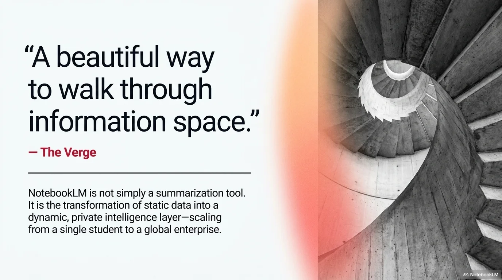

> [!TIP]
> This is a simplified preview. [View Full YAML](styles/academic_edge.yaml)

```yaml
description: "A sophisticated academic and editorial aesthetic inspired by thesis defenses and research portfolios. It balances high-contrast black and white photography with bold red accents and soft warm 'aura' gradients. Powered by the geometric Codec Pro typeface."
design_system:
  global_style:
    theme: "Academic Edge. Editorial research style with B&W imagery and crimson accents."
    typography: 
      primary_heading: "Codec Pro, sans-serif"
      secondary_heading: "Codec Pro, light"
      body_text: "Inter, sans-serif"
    color_palette:
      primary: "#D00000" # Academic Red
      background: "#FFFFFF" # Pure White
      surface: "#F8F9FA" # Ultra Light Grey
      accent_gradient: "Soft grainy gradient from peach to soft red"
      text_main: "#1A1A1A"
      text_secondary: "#4A4A4A"
    key_visual_elements: 
      - "High-contrast black and white photography"
      - "Bold red arrows and list bullets"
      - "Subtle film grain on background gradients"
      - "Minimalist horizontal dividers"

  image_generation_prompts:
    style_guidelines: "Editorial photography style, high-contrast black and white, minimalist composition, soft warm aura light leaks, architectural and nature details, professional academic aesthetic, Codec Pro font vibe."
    themes:
      - target: "Research & Detail"
        prompt_elements: "Close-up of architectural structures in high-contrast black and white, sharp lines, minimalist."
      - target: "Atmospheric Academic"
        prompt_elements: "Abstract soft warm aura gradient with light film grain, crimson accents, professional and clean."

slide_layout_templates:
  - type: "Thesis_Hero"
    usage: "Large bold title on the left with a vertical aura gradient on the right"
  - type: "Step_Process"
    usage: "Horizontal flow using B&W images connected by bold red arrows"
  - type: "Editorial_Results"
    usage: "Data charts with red bars and clean B&W background image integration"
  - type: "Recommendation_Cards"
    usage: "Split layout with B&W photos on top and red headings below"
```

---


### 🚀 Tech & Innovation

#### Visual Discovery

Focuses on visual-first layouts, card-based components with high border-radius, and vibrant red accents to drive engagement and focus. Inspired by modern discovery feeds.

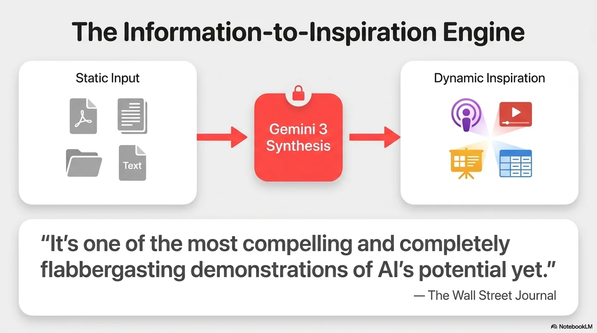

> [!TIP]
> This is a simplified preview. [View Full YAML](styles/visual_discovery.yaml)

```yaml
design_system:
  global_style:
    theme: "Modern, visual-first, and organized. Inspired by card-based discovery aesthetics. Uses card-based layouts with high border radius, soft shadows, and vibrant accents."
    typography: 
      primary_heading: "Clean rounded sans-serif (e.g., Roboto, Helvetica Rounded), bold"
      secondary_heading: "Simple sans-serif, medium weight, clean"
      body_text: "Functional sans-serif, standard weights, high contrast on white"
    color_palette:
      primary_color: "#E60023"
      background: "#FFFFFF"
      text_main: "#111111"
      accent_color: "#EFEFEF"
    key_visual_elements: 
      - "Rounded corners (16px to 24px) for cards and images"
      - "Drop shadows for depth"
      - "Grid-based image distribution"
      - "Circular profiles and 'save' style button call-outs"

  image_generation_prompts:
    style_guidelines: "Clean white studio background, vibrant accents, rounded corners, drop shadows, flat design elements, organized grid."

slide_layout_templates:
  - type: "Cover_Discovery"
    usage: "Impactful intro slide"
  - type: "Card_Grid_Insights"
    usage: "Presenting multiple features or items"
  - type: "Masonry_Vision"
    usage: "Inspiration or mood board"
```

#### Urban Ribbon

An authoritative and structured corporate aesthetic featuring distinctive 3D-folded "ribbon" elements and sharp diagonal background slices. It combines a professional charcoal and beige palette with golden-hour cityscape photography, creating a sense of metropolitan sophistication and executive power.

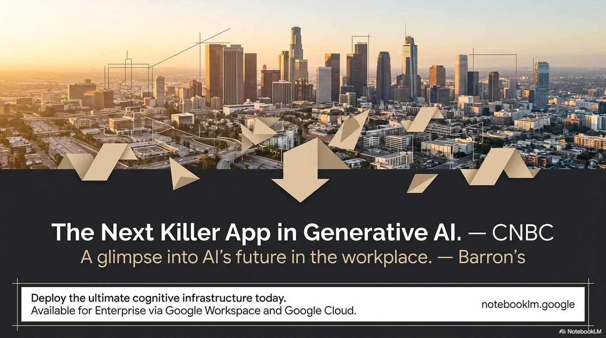

> [!TIP]
> This is a simplified preview. [View Full YAML](styles/urban_ribbon.yaml)

```yaml
design_system:
  global_style:
    theme: "Authoritative urban aesthetic. 3D-folded ribbons and diagonal slices."
    typography: 
      primary_heading: "Bold authoritative sans-serif (League Spartan)"
      secondary_heading: "Professional sans-serif"
      body_text: "Clean functional sans-serif"
    color_palette:
      primary_color: "#333333"
      secondary_color: "#D9C5B2"
      background_dark: "#5C4B41"
      text_main: "#1A1A1A"
    key_visual_elements: 
      - "3D-folded 'ribbon' overlays for titles and labels"
      - "Sharp diagonal background slices and parallelogram containers"
      - "Golden-hour urban landscapes and skyscraper photography"
      - "High-contrast charcoal and warm beige palette"

slide_layout_templates:
  - type: "Executive_Pitch"
    usage: "Professional business cover with urban backdrop and ribbon accents"
  - type: "Leadership_Grid"
    usage: "Team profiles with parallelogram-shaped portrait cards"
  - type: "Strategic_Comparison"
    usage: "Comparative data with diagonal dividers and vertical image bleeds"
```

#### Neon Pulsar

Futuristic, high-energy, and tech-focused design. This dark mode aesthetic uses vibrant neon gradients (Cyan, Magenta, Purple) and glassmorphic elements to create a cutting-edge startup atmosphere.

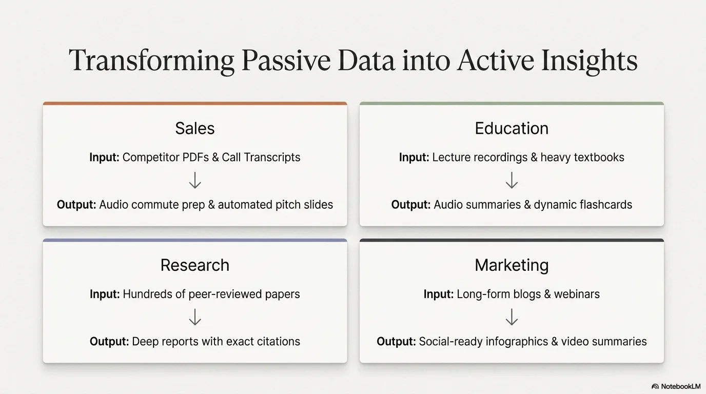

> [!TIP]
> This is a simplified preview. [View Full YAML](styles/neon_pulsar.yaml)

```yaml
design_system:
  global_style:
    theme: "Futuristic, high-energy, tech-focused. Dark mode neon."
    typography: 
      primary_heading: "Extra-bold modern sans-serif (e.g., Inter)"
      secondary_heading: "Medium sans-serif, high contrast"
      body_text: "Clean sans-serif for dark mode"
    color_palette:
      primary_color: "#FFFFFF"
      background: "#000000"
      accent_cyan: "#00F2FF"
      accent_purple: "#7000FF"
      accent_magenta: "#FF00E5"
    key_visual_elements: 
      - "Blurred neon gradient spheres"
      - "Concentric rings and digital orbits"
      - "Pill-shaped containers"
      - "Glassmorphic cards with neon borders"

slide_layout_templates:
  - type: "Tech_Startup_Hero"
    usage: "Main title or key announcement"
  - type: "Service_Orbits"
    usage: "Showing features around a core concept"
  - type: "Neon_Bento_Grid"
    usage: "Showcasing tech specs or team members"
```

#### Midnight Tactical

Modern, tech-utilitarian design with a high-contrast matte black base and vibrant lime green accents. Features industrial aesthetic elements like tilted boxes, double chevrons, and monospace metadata.

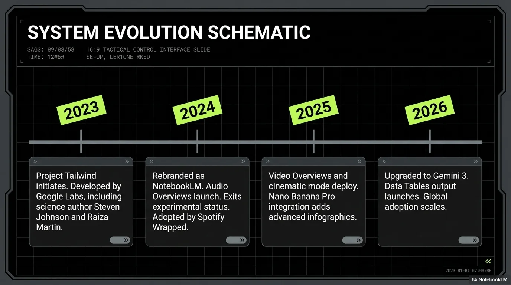

> [!TIP]
> This is a simplified preview. [View Full YAML](styles/midnight_tactical.yaml)

```yaml
design_system:
  global_style:
    theme: "Modern tech-utilitarian. Matte Black & Lime Green."
    typography: 
      primary_heading: "Bold geometric sans-serif (e.g., Space Grotesk)"
      secondary_heading: "Medium sans-serif, high contrast white"
      body_text: "Clean sans-serif for dark backgrounds"
      accent_mono: "Monospace for technical labels"
    color_palette:
      primary_color: "#C6FF00"
      background: "#000000"
      text_main: "#FFFFFF"
    key_visual_elements: 
      - "Tilted lime green highlight boxes (fractional labels)"
      - "Pill-shaped labels in dark green"
      - "Double chevron accents (<<)"
      - "Rounded-corner modular grid containers"

slide_layout_templates:
  - type: "Tactical_Hero"
    usage: "Section headers or main announcements"
  - type: "Utility_Agenda"
    usage: "Agenda or multi-point summaries"
  - type: "Textured_Gallery"
    usage: "Showcasing visual references or products"
```

#### Architectural Mono

Modern brutalist, monochromatic, and architectural design. Inspired by minimalist gallery aesthetics, it features high-contrast grayscale photography, large technical stamps, and sleek sans-serif typography.

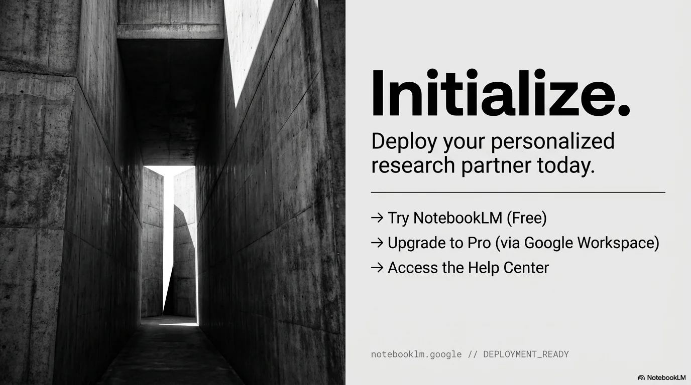

> [!TIP]
> This is a simplified preview. [View Full YAML](styles/architectural_mono.yaml)

```yaml
design_system:
  global_style:
    theme: "Modern brutalist, monochromatic, and architectural. High-contrast grayscale."
    typography: 
      primary_heading: "Clean modern sans-serif (e.g., Inter, Helvetica), bold"
      secondary_heading: "Refined sans-serif, standard weight"
      body_text: "Functional sans-serif, technical feel"
      accent_mono: "Monospace for technical labels"
    color_palette:
      primary_color: "#111111"
      background: "#E8E8E8"
      text_main: "#111111"
      accent_gray: "#B0B0B0"
    key_visual_elements: 
      - "High-contrast grayscale architectural photography"
      - "Large year stamps (e.g., '20 | 25')"
      - "Thin horizontal technical dividers"
      - "Thin arrow icons (→)"
      - "Vertical section labels"

slide_layout_templates:
  - type: "Architectural_Cover"
    usage: "Impactful intro with full-page imagery"
  - type: "Mission_Grid"
    usage: "Masonry grid for multiple references"
  - type: "Sliver_About"
    usage: "Vertical image sliver presentation"
```

#### Architectural Cobalt

Technical, dark architectural, and blueprint-inspired design. Features deep charcoal backgrounds with vibrant cobalt blue gradients and precise 'sight' crosshair visual elements for a high-end engineering feel.


> [!TIP]
> This is a simplified preview. [View Full YAML](styles/architectural_cobalt.yaml)

```yaml
design_system:
  global_style:
    theme: "Technical, dark architectural, blueprint-inspired. Deep charcoal with cobalt blue."
    typography: 
      primary_heading: "Bold high-contrast sans-serif"
      secondary_heading: "Medium sans-serif, clean"
      body_text: "Functional sans-serif, optimized for dark mode"
      technical_label: "Small uppercase sans-serif, spaced"
    color_palette:
      primary_color: "#304FFE"
      background: "#111111"
      text_main: "#FFFFFF"
      accent_overlay: "rgba(48, 79, 254, 0.2)"
    key_visual_elements: 
      - "Circular crosshair/sight icons"
      - "Vibrant cobalt blue gradient overlays"
      - "Dark, high-shadow architectural photography"
      - "Thin white structural grid lines"

slide_layout_templates:
  - type: "Cobalt_Impact_Cover"
    usage: "Impactful intro with technical structural visuals"
  - type: "Dark_Project_Detail"
    usage: "Showcasing projects with technical metadata"
  - type: "Expertise_Profile"
    usage: "Team introduction or profile highlights"
```


#### Startup Aura

A high-end, tech-focused pitch deck aesthetic. It features soft 'mesh' gradients in blue tones, clean Open Sauce typography, and a professional dark-mode charcoal base. Designed for startups, product launches, and innovative business presentations.

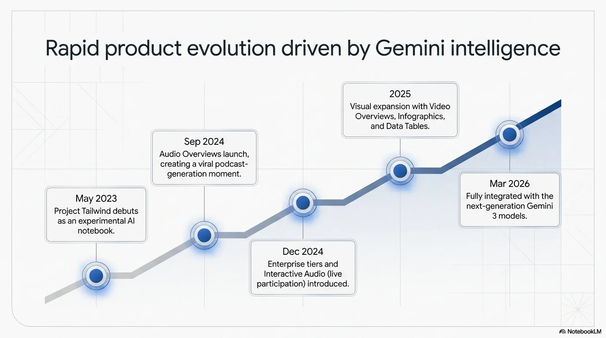

> [!TIP]
> This is a simplified preview. [View Full YAML](styles/startup_aura.yaml)

```yaml
description: "A high-end, tech-focused pitch deck aesthetic. It features soft 'mesh' gradients in blue tones, clean Open Sauce typography, and a professional dark-mode charcoal base. Designed for startups, product launches, and innovative business presentations."
design_system:
  global_style:
    theme: "Startup Aura. Modern pitch deck with mesh gradients and tech-centric typography."
    typography: 
      primary_heading: "Open Sauce, sans-serif"
      secondary_heading: "Open Sauce Sans, medium weight"
      body_text: "Open Sauce Sans, light weight"
    color_palette:
      primary: "#007BFF" # Electric Blue
      background: "#1A1A1A" # Deep Charcoal
      surface: "#2D2D2D" # Slate Grey
      accent_gradient: "Soft mesh gradient from blue to light grey"
      text_main: "#FFFFFF"
      text_secondary: "#B0B0B0"
    key_visual_elements: 
      - "Soft blue 'aura' mesh gradients as background accents"
      - "Thin 1px borders for content cards"
      - "Rounded rectangles with 12px-16px corners"
      - "Minimalist line icons and clean data visualization charts"

  image_generation_prompts:
    style_guidelines: "Modern tech aesthetic, soft blue mesh gradients, minimalist corporate photography, clean professional lighting, high-end startup presentation style, Open Sauce font vibe."
    themes:
      - target: "Innovation Backdrop"
        prompt_elements: "Soft blue and grey abstract mesh gradient, smooth transition, professional tech background, minimalist."
      - target: "Team & Tech"
        prompt_elements: "Close-up of a professional modern workspace with soft blue lighting, high-tech aesthetic, clean composition."

slide_layout_templates:
  - type: "Pitch_Hero"
    usage: "Main title slide with a large aura gradient accent on the right"
  - type: "Service_Grid"
    usage: "Features or services organized in outlined rounded cards"
  - type: "Data_Traction"
    usage: "Key metrics and growth charts with thin blue line accents"
  - type: "Timeline_Milestones"
    usage: "Company history or roadmaps using dotted line connectors and blue nodes"
```


#### Neon Venture

A bold, futuristic startup aesthetic that blends deep indigo backgrounds with vibrant neon lavender accents. It features iridescent 3D geometric shapes, glassmorphism UI elements, and dynamic vertical typography. Perfect for high-tech ventures, AI startups, and forward-thinking pitches.

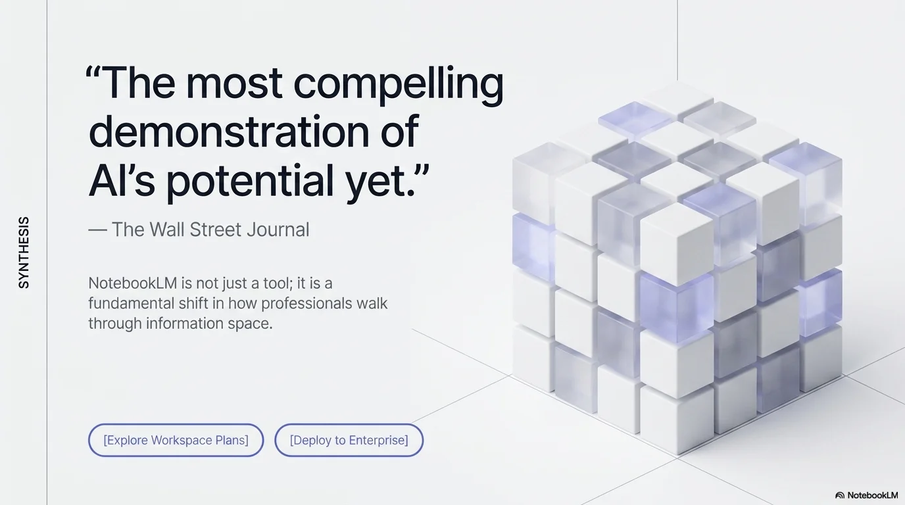

> [!TIP]
> This is a simplified preview. [View Full YAML](styles/neon_venture.yaml)

```yaml
description: "A bold, futuristic startup aesthetic that blends deep indigo backgrounds with vibrant neon lavender accents. It features iridescent 3D geometric shapes, glassmorphism UI elements, and dynamic vertical typography. Perfect for high-tech ventures, AI startups, and forward-thinking pitches."
design_system:
  global_style:
    theme: "Neon Venture. Cyber-corporate style with holographic 3D elements and neon accents."
    typography: 
      primary_heading: "Open Sauce, sans-serif"
      secondary_heading: "Open Sauce, medium"
      body_text: "Open Sauce, light"
    color_palette:
      primary: "#9D72FF" # Vibrant Neon Lavender
      background: "#0B071E" # Deep Space Indigo
      surface: "#1A1438" # Dark Purple Surface
      accent_gradient: "Iridescent holographic shimmer with purple and teal reflections"
      text_main: "#FFFFFF"
      text_secondary: "#B0A9D1"
    key_visual_elements: 
      - "Holographic 3D geometric primitives (cubes, spheres, pyramids)"
      - "Vertical sidebar titles for section headers"
      - "Glassmorphism cards with subtle neon glow shadows"
      - "Thin pill-shaped badge containers for categories"

  image_generation_prompts:
    style_guidelines: "Futuristic corporate tech style, 3D iridescent geometric objects, deep indigo lighting, neon purple accents, glassmorphism surfaces, sharp focus, professional innovative aesthetic, Open Sauce font vibe."
    themes:
      - target: "Data Visualization"
        prompt_elements: "Futuristic 3D bar chart with neon lavender glow, holographic textures, floating over deep indigo background."
      - target: "Abstract Growth"
        prompt_elements: "A stack of iridescent 3D cubes with metallic reflections, neon purple light leaks, high-tech minimalist composition."

slide_layout_templates:
  - type: "Neon_Hero"
    usage: "Massive title overlapping an iridescent 3D shape with neon badges above"
  - type: "Glass_Market_Analysis"
    usage: "Vertical section title on the left with data cards using glassmorphism effects"
  - type: "Corporate_Overview"
    usage: "Split layout with a long horizontal image banner and clean tech-text below"
  - type: "Holographic_Team"
    usage: "Team profiles in glass containers with neon hover-style accents"
```

---


### 🌿 Nature & Wellness

#### Eco Modern

A modern, sustainable, and high-impact aesthetic inspired by nature and environmental initiatives. It features immersive landscape photography, dark mode backgrounds, and glassmorphic (frosted glass) overlays. A signature lime-green accent dot provides a contemporary brand finish.

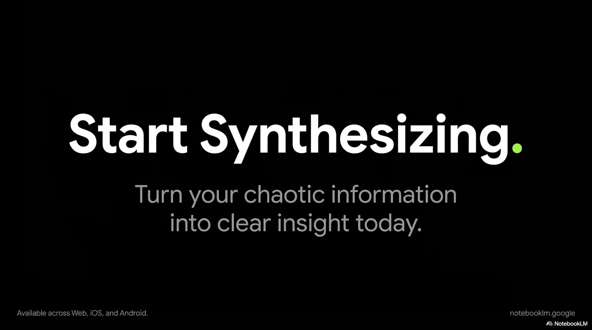

> [!TIP]
> This is a simplified preview. [View Full YAML](styles/eco_modern.yaml)

```yaml
design_system:
  global_style:
    theme: "Sustainable, modern nature aesthetic. Dark mode with glassmorphism."
    typography: 
      primary_heading: "Extra-bold geometric sans-serif (Codec Pro)"
      secondary_heading: "Clean bold sans-serif"
      body_text: "Highly legible functional sans-serif"
    color_palette:
      primary_color: "#D4FF00"
      secondary_color: "#5D8AA8"
      background_dark: "#000000"
      text_main: "#FFFFFF"
    key_visual_elements: 
      - "Full-bleed high-saturation nature photography"
      - "Frosted glass containers for text overlays"
      - "Large rounded corners on all UI elements"
      - "Signature lime-green accent dot after titles"

slide_layout_templates:
  - type: "Immersive_Hero"
    usage: "High-impact cover with full-bleed nature backdrop"
  - type: "Frosted_Agenda"
    usage: "Agenda points inside a glassmorphic container"
  - type: "Eco_Action_Grid"
    usage: "Practical tips with alternating rounded image/text blocks"
```

#### Botanical Journal

Eco-friendly, natural, and scrapbook-inspired design. Features hand-drawn botanical doodles (leaves, vines, flowers), washi tape accents, and torn notebook paper textures on a warm cream background.

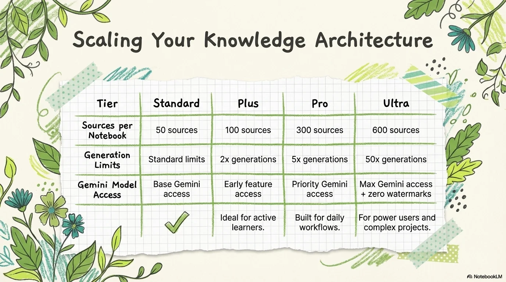

> [!TIP]
> This is a simplified preview. [View Full YAML](styles/botanical_journal.yaml)

```yaml
design_system:
  global_style:
    theme: "Eco Scrapbook. Natural & Botanical."
    typography: 
      primary_heading: "Bubbly hand-drawn sans-serif (e.g., Fredoka One)"
      secondary_heading: "Friendly rounded sans-serif"
      body_text: "Clean legible sans-serif"
    color_palette:
      primary_color: "#7CB342"
      background: "#F9F7F1"
      accent_lime: "#D4E157"
    key_visual_elements: 
      - "Torn binder paper textures"
      - "Decorative washi tape strips"
      - "Hand-drawn botanical doodles"
      - "Circular or oval photo frames"

slide_layout_templates:
  - type: "Botanical_Hero"
    usage: "Main title or environmental intros"
  - type: "Notebook_Scrapbook"
    usage: "Detailed points or objectives"
  - type: "Eco_Profile"
    usage: "Nature focus or overviews"
```

#### The Seasons

An organic and earthy aesthetic inspired by sustainable branding, apothecary, and wellness. It features high-contrast serifs, deep olive and terracotta tones, and botanical photography with stadium-shaped masks and balanced asymmetric layouts.

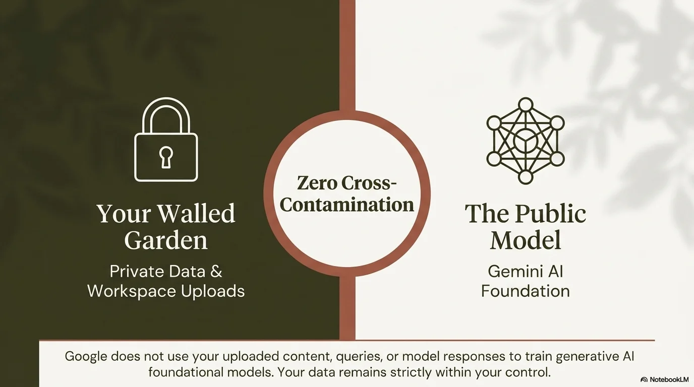

> [!TIP]
> This is a simplified preview. [View Full YAML](styles/the_seasons.yaml)

```yaml
design_system:
  global_style:
    theme: "Organic, earthy wellness and high-end botanical branding."
    typography: 
      primary_heading: "Classic, high-contrast serif (Playfair Display)"
      secondary_heading: "Refined italic serif or modern sans-serif"
      body_text: "Clean minimalist sans-serif"
    color_palette:
      primary_color: "#3D3D29"
      secondary_color: "#8F564B"
      background: "#F9F6F1"
      text_main: "#2D2D2D"
    key_visual_elements: 
      - "Macro botanical photography (eucalyptus, tropical leaves)"
      - "Stadium-shaped masks for images and content blocks"
      - "Shadow overlays of plant leaves for atmosphere"
      - "Earthy-toned data visualizations (Venn, bar charts)"

slide_layout_templates:
  - type: "Organic_Hero"
    usage: "Large Serif Title over botanical background bleed"
  - type: "Product_Inventory"
    usage: "Catalog list of stadium-shaped cards with portrait bleed"
  - type: "Data_Venn"
    usage: "Mapping brand values with terracotta and olive tones"
```

#### Scholar's Journal

Academic, vintage, and scientific design. Inspired by 19th-century botanical engravings and researcher journals. It features heavy coarse paper textures and deep indigo line art illustrations for a scholarly feel.

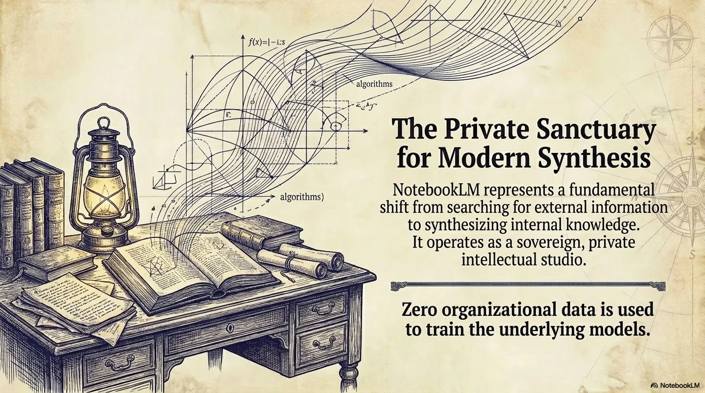

> [!TIP]
> This is a simplified preview. [View Full YAML](styles/scholars_journal.yaml)

```yaml
design_system:
  global_style:
    theme: "Academic, vintage, and scientific. Botanical engravings focus."
    typography: 
      primary_heading: "Traditional serif or slab serif (e.g., Trocchi)"
      secondary_heading: "Classic serif, clean"
      body_text: "Functional traditional serif"
    color_palette:
      primary_color: "#3E4E63"
      background: "#D1D1D1"
      text_main: "#2D3436"
    key_visual_elements: 
      - "Etched/Engraved line art illustrations"
      - "Heavy coarse paper texture grain"
      - "Indigo on Parchment monochromatic scheme"

slide_layout_templates:
  - type: "Scholar_Intro"
    usage: "Title slides or section starts"
  - type: "Illustration_Focus"
    usage: "Presenting concepts with a visual anchor"
  - type: "Balanced_Journal"
    usage: "Summary or Q&A slides"
```

#### Classical Scrapbook

A tactile, layered design that blends classical art history with a handcrafted scrapbook aesthetic. It features overlapping kraft paper and parchment textures, torn edges, washi tape accents, and elegant flowing script combined with classic serif typography.

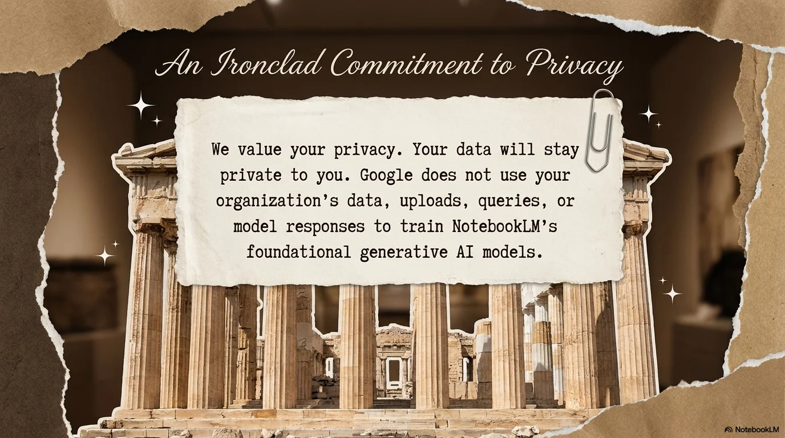

> [!TIP]
> This is a simplified preview. [View Full YAML](styles/classical_scrapbook.yaml)

```yaml
design_system:
  global_style:
    theme: "Classical art history meets scrapbook collage. Layered tactile materials."
    typography: 
      primary_heading: "Elegant flowing cursive script"
      secondary_heading: "Classic high-contrast serif"
      body_text: "Clean legible serif"
    color_palette:
      primary_color: "#8C7156"
      background: "#A68E74"
      text_main: "#403024"
      accent_color: "#D9C5B2"
    key_visual_elements: 
      - "Overlapping kraft and white paper with torn edges"
      - "Classical sculpture and impressionist painting cutouts"
      - "Washi tape, paper-clips, and sparkle accents"
      - "Circular timeline nodes and framed artwork"

slide_layout_templates:
  - type: "Cover_Collage"
    usage: "Tactile intro with cursive title and classical artifacts"
  - type: "Timeline_Historical"
    usage: "Chronological events with statue cutouts"
  - type: "Ending_Statement"
    usage: "Final slide with landscape bleed and torn edges"
```

#### Vibrant Agency

A high-energy, playful aesthetic inspired by modern marketing and creative agencies. It features vibrant orange "bubble" elements, wavy dividers, and friendly bold typography. Perfect for pitches that need to convey enthusiasm and creative momentum.

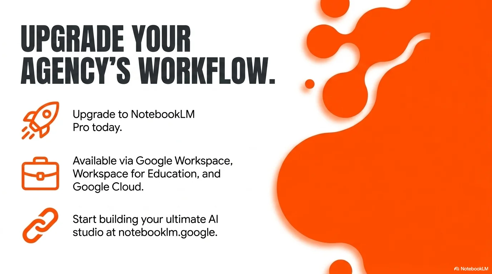

> [!TIP]
> This is a simplified preview. [View Full YAML](styles/vibrant_agency.yaml)

```yaml
design_system:
  global_style:
    theme: "High-energy, playful marketing and creative agency aesthetic."
    typography: 
      primary_heading: "Bold friendly sans-serif (Montserrat)"
      secondary_heading: "Approachable modern sans-serif"
      body_text: "Clean legible sans-serif"
    color_palette:
      primary_color: "#FF7A21"
      secondary_color: "#FFB392"
      background: "#FFFFFF"
      text_main: "#1A1A1A"
    key_visual_elements: 
      - "Large rounded 'bubble' background elements"
      - "Wavy and curved dividers for section transitions"
      - "Studio-style photography with vibrant monochromatic backgrounds"
      - "Circular progress indicators and playful donut charts"

slide_layout_templates:
  - type: "Campaign_Cover"
    usage: "Impactful title for marketing pitches with bubble accents"
  - type: "Strategy_Cards"
    usage: "Grid of large rounded cards with orange icons"
  - type: "Performance_Kpis"
    usage: "Visualizing metrics with orange donut progress charts"
```


#### Vitality Glow

An energetic and fresh aesthetic focused on health, wellness, and vitality. It features the friendly Poppins typeface, vibrant lime green and bright blue accents, and dynamic diagonal shapes. Perfect for wellness coaching, sports nutrition, and preventive healthcare presentations.

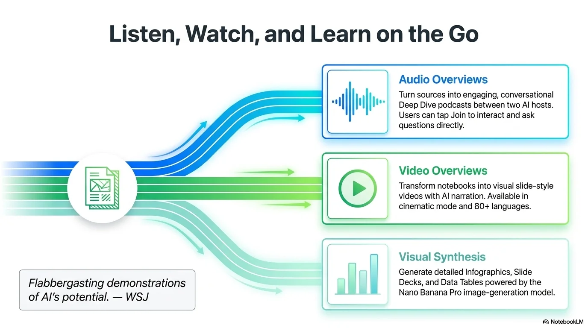

> [!TIP]
> This is a simplified preview. [View Full YAML](styles/vitality_glow.yaml)

```yaml
description: "An energetic and fresh aesthetic focused on health, wellness, and vitality. It features the friendly Poppins typeface, vibrant lime green and bright blue accents, and dynamic diagonal shapes. Perfect for wellness coaching, sports nutrition, and preventive healthcare presentations."
design_system:
  global_style:
    theme: "Vitality Glow. Energetic wellness style with diagonal accents and vibrant colors."
    typography: 
      primary_heading: "Poppins, sans-serif"
      secondary_heading: "Poppins, medium"
      body_text: "Poppins, light"
    color_palette:
      primary: "#10B981" # Vitality Green
      secondary: "#3B82F6" # Energy Blue
      background: "#FFFFFF" # Pure White
      surface: "#F0FDFA" # Mint Tint Surface
      text_main: "#1F2937"
      text_secondary: "#6B7280"
    key_visual_elements: 
      - "Large diagonal parallelograms in green and blue"
      - "Circular image masks for portraits and product shots"
      - "Small diamond-shaped (rhombus) accents"
      - "Clean white space with high-contrast vibrant accents"

  image_generation_prompts:
    style_guidelines: "Bright lifestyle photography, outdoor settings, high-key lighting, vibrant green and blue color grading, healthy living themes, energetic and optimistic vibe, Poppins font vibe."
    themes:
      - target: "Hydration & Vitality"
        prompt_elements: "Close-up of fresh water with mint leaves, bright sunlight, vibrant green and blue tones, refreshing aesthetic."
      - target: "Active Lifestyle"
        prompt_elements: "People exercising in a sunlit park, blurry green background, focus on movement and energy, optimistic atmosphere."

slide_layout_templates:
  - type: "Vitality_Hero"
    usage: "Large title with a massive diagonal green stripe in the background"
  - type: "Health_TOC_Circles"
    usage: "Table of contents with section numbers inside small green circles"
  - type: "Wellness_Grid"
    usage: "Information cards with diamond icons and subtle blue borders"
  - type: "Organic_Comparison"
    usage: "Side-by-side comparison using circular masks and diagonal dividers"
```


#### Modern Wellness

A sleek and professional aesthetic for contemporary health and lifestyle content. It utilizes the geometric TT Firs Neue typeface to convey precision and modernity. Featuring a balanced palette of deep slate, forest green, and amber orange, it combines clean photography with minimalist vector shapes and ample white space for a premium corporate wellness feel.


> [!TIP]
> This is a simplified preview. [View Full YAML](styles/modern_wellness.yaml)

```yaml
description: "A sleek and professional aesthetic for contemporary health and lifestyle content. It utilizes the geometric TT Firs Neue typeface to convey precision and modernity. Featuring a balanced palette of deep slate, forest green, and amber orange, it combines clean photography with minimalist vector shapes and ample white space for a premium corporate wellness feel."
design_system:
  global_style:
    theme: "Modern Wellness. Professional and geometric design for contemporary lifestyle presentations."
    typography: 
      primary_heading: "TT Firs Neue, sans-serif"
      secondary_heading: "TT Firs Neue, medium"
      body_text: "Inter, regular"
    color_palette:
      primary: "#263238" # Deep Slate
      secondary: "#2E7D32" # Forest Green
      accent: "#FF8F00" # Amber Orange
      background: "#FFFFFF" # Pure White
      text_main: "#263238"
      text_secondary: "#546E7A"
    key_visual_elements: 
      - "Clean, high-quality lifestyle photography"
      - "Minimalist flat vector illustrations of healthy activities"
      - "Geometric accents (rounded corners, circles, thick lines)"
      - "Modern info-boxes with subtle colored headers"

  image_generation_prompts:
    style_guidelines: "Modern minimalist photography, flat vector accents, deep green and amber color scheme, geometric composition, clean and professional atmosphere, white space."
    themes:
      - target: "Healthy Habits"
        prompt_elements: "A person practicing yoga in a bright modern room, minimalist green and orange graphic overlays, premium wellness vibe."
      - target: "Nutrition Guide"
        prompt_elements: "Close-up of fresh vegetables on a white table, geometric slate blue frames, clean and technical look."

slide_layout_templates:
  - type: "Modern_Wellness_Cover"
    usage: "Large TT Firs Neue title centered with a geometric green accent and a lifestyle photo background"
  - type: "Icon_List"
    usage: "Bullet points accompanied by clean flat icons in amber and forest green"
  - type: "Split_Visual"
    usage: "One side with a large photo, the other with organized text on a clean white background"
```


#### Deep Forest

A rugged and authentic aesthetic that honors the raw beauty of deep forests and mountain landscapes. It features the wide and impactful Agrandir Wide typeface for headlines that stand out against vast nature photography. Characterized by a palette of deep forest green and charcoal, it uses high-contrast layouts and minimal leaf icons to create a sense of conservation and wilderness adventure.


> [!TIP]
> This is a simplified preview. [View Full YAML](styles/deep_forest.yaml)

```yaml
description: "A rugged and authentic aesthetic that honors the raw beauty of deep forests and mountain landscapes. It features the wide and impactful Agrandir Wide typeface for headlines that stand out against vast nature photography. Characterized by a palette of deep forest green and charcoal, it uses high-contrast layouts and minimal leaf icons to create a sense of conservation and wilderness adventure."
design_system:
  global_style:
    theme: "Deep Forest. Rugged and minimalist nature design for environmental and hiking presentations."
    typography: 
      primary_heading: "Agrandir Wide, sans-serif"
      secondary_heading: "Agrandir, regular"
      body_text: "Poppins, regular"
    color_palette:
      primary: "#1B5E20" # Deep Forest Green
      secondary: "#212121" # Charcoal Black
      background: "#FAFAFA" # Off-White
      surface: "#E8F5E9" # Pale Leaf Green
      text_main: "#1B5E20"
      text_secondary: "#424242"
    key_visual_elements: 
      - "Full-bleed photography of forests and mountains"
      - "Minimalist leaf icons used as bullet points or accents"
      - "High-contrast layouts (large dark headlines on light backgrounds)"
      - "Rounded image corners to soften the rugged imagery"

  image_generation_prompts:
    style_guidelines: "High-contrast nature photography, deep forest green and charcoal accents, wide cinematic shots, rugged wilderness atmosphere, Agrandir Wide font vibe."
    themes:
      - target: "Sustainability"
        prompt_elements: "Close-up of pine needles with morning dew, deep green tones, minimalist charcoal text box, authentic and environmental."
      - target: "Hiking Adventure"
        prompt_elements: "A person walking on a mountain trail, vast forest background, high contrast, rugged and adventurous aesthetic."

slide_layout_templates:
  - type: "Wilderness_Headline"
    usage: "Large Agrandir Wide headline overlapping a cinematic forest photo"
  - type: "Leaf_Info"
    usage: "Bullet points marked by small green leaf icons on a clean charcoal surface"
  - type: "Contrast_Visual"
    usage: "A split slide with a dark green side for text and a full-height photo on the other"
```


#### Urban Jungle

A fresh and organic aesthetic designed for urban gardening and botanical pitch decks. It combines the modern Agrandir and Poppins typefaces for a clean, professional look with a friendly touch. Characterized by soft beige backgrounds, vibrant moss green accents, and iconic Monstera leaf decorations, it creates a sophisticated yet growth-oriented atmosphere for plant-centric content.


> [!TIP]
> This is a simplified preview. [View Full YAML](styles/urban_jungle.yaml)

```yaml
description: "A fresh and organic aesthetic designed for urban gardening and botanical pitch decks. It combines the modern Agrandir and Poppins typefaces for a clean, professional look with a friendly touch. Characterized by soft beige backgrounds, vibrant moss green accents, and iconic Monstera leaf decorations, it creates a sophisticated yet growth-oriented atmosphere for plant-centric content."
design_system:
  global_style:
    theme: "Urban Jungle. Modern botanical design for gardening and plant-focused pitch decks."
    typography: 
      primary_heading: "Agrandir, sans-serif"
      secondary_heading: "Poppins, medium"
      body_text: "Poppins, regular"
    color_palette:
      primary: "#33691E" # Moss Green
      secondary: "#1B5E20" # Dark Forest Green
      background: "#EFEBE9" # Soft Beige / Nude
      surface: "#F1F8E9" # Pale Green Surface
      text_main: "#1B5E20"
      text_secondary: "#546E7A"
    key_visual_elements: 
      - "Decorative Monstera and plant leaf overlays in the corners"
      - "Ultra-rounded containers for images and text blocks"
      - "Soft beige backgrounds that make green tones pop"
      - "Clean and airy layouts with focused botanical imagery"

  image_generation_prompts:
    style_guidelines: "Modern botanical illustration, Monstera leaves, soft beige and moss green palette, clean and professional pitch deck style, rounded corners, organic and fresh atmosphere."
    themes:
      - target: "Plant Cultivation"
        prompt_elements: "A variety of indoor plants in modern pots, soft sunlight, beige background, fresh and sophisticated botanical look."
      - target: "Market Potential"
        prompt_elements: "Minimalist greenhouse interior, green and nude color scheme, clean professional layout, organic growth vibes."

slide_layout_templates:
  - type: "Botanical_Pitch_Cover"
    usage: "Headline centered with large Monstera leaf shadows and a soft beige background"
  - type: "Plant_Feature"
    usage: "Large photo with ultra-rounded corners on one side and clean bullet points on the other"
  - type: "Leaf_Divider"
    usage: "A slide with a horizontal line decorated by small leaf icons to separate sections"
  - type: "Green_Summary"
    usage: "Final slide with a large 'Thank You' and a vibrant plant branch across the bottom"
```


#### Modern Farm

A robust and contemporary aesthetic that merges industrial agriculture with modern business design. It features bold Agrandir headlines and clean Poppins body text. Characterized by a striking palette of deep barn red and olive green, it uses rounded photography of farm life, daisy icons, and high-contrast color blocks to create a grounded yet professional atmosphere.


> [!TIP]
> This is a simplified preview. [View Full YAML](styles/modern_farm.yaml)

```yaml
description: "A robust and contemporary aesthetic that merges industrial agriculture with modern business design. It features bold Agrandir headlines and clean Poppins body text. Characterized by a striking palette of deep barn red and olive green, it uses rounded photography of farm life, daisy icons, and high-contrast color blocks to create a grounded yet professional atmosphere."
design_system:
  global_style:
    theme: "Modern Farm. Bold and industrial agricultural design for business and rural presentations."
    typography: 
      primary_heading: "Agrandir, sans-serif"
      secondary_heading: "Poppins, medium"
      body_text: "Poppins, regular"
    color_palette:
      primary: "#B71C1C" # Barn Red
      secondary: "#558B2F" # Olive Green
      background: "#FFFFFF" # White
      surface: "#212121" # Deep Charcoal
      text_main: "#212121"
      text_secondary: "#B71C1C"
    key_visual_elements: 
      - "Photography of modern barns and green meadows"
      - "Charming daisy and real leaf icons as decorative accents"
      - "Bold, solid red and green background sections"
      - "Rounded containers for images and info-boxes"

  image_generation_prompts:
    style_guidelines: "Modern agricultural photography, barn red and olive green palette, high-contrast business layout, rural and professional atmosphere, daisy icons, rounded corners."
    themes:
      - target: "Business Model"
        prompt_elements: "An aerial view of a modern green farm, barn red graphic overlays, professional and robust agricultural vibe."
      - target: "Our Solution"
        prompt_elements: "Close-up of a daisy and a green leaf on a white surface, olive green frames, clean and contemporary farm aesthetic."

slide_layout_templates:
  - type: "Modern_Farm_Cover"
    usage: "Large headline on a white background with a large rounded farm photo and a daisy icon"
  - type: "Barn_Red_Problem"
    usage: "A slide with a solid deep red background and white text for high impact"
  - type: "Leaf_Feature_Grid"
    usage: "A 3-column grid where each item has a different leaf or flower icon at the top"
```


#### Sustainable Agri

A clean and data-driven aesthetic for the future of farming and sustainable technology. It utilizes the neutral Canva Sans typeface to prioritize content clarity. Characterized by a monochrome palette of lush greens—from deep forest to vibrant lime—it features aerial crop photography, semi-transparent overlays, and structured roadmaps for a professional agro-tech feel.


> [!TIP]
> This is a simplified preview. [View Full YAML](styles/sustainable_agri.yaml)

```yaml
description: "A clean and data-driven aesthetic for the future of farming and sustainable technology. It utilizes the neutral Canva Sans typeface to prioritize content clarity. Characterized by a monochrome palette of lush greens—from deep forest to vibrant lime—it features aerial crop photography, semi-transparent overlays, and structured roadmaps for a professional agro-tech feel."
design_system:
  global_style:
    theme: "Sustainable Agri. Technical and structured green design for innovation in agriculture."
    typography: 
      primary_heading: "Canva Sans, sans-serif"
      secondary_heading: "Canva Sans, medium"
      body_text: "Canva Sans, regular"
    color_palette:
      primary: "#1B5E20" # Forest Green
      secondary: "#AED581" # Lime Green
      background: "#FFFFFF" # White
      surface: "#33691E" # Moss Green
      text_main: "#1B5E20"
      text_secondary: "#AED581"
    key_visual_elements: 
      - "Aerial and macro photography of sustainable crops"
      - "Semi-transparent green overlays for text readability over images"
      - "Structured roadmaps and timelines with clean dots and lines"
      - "Minimalist grid layouts for presenting tech features or data"

  image_generation_prompts:
    style_guidelines: "Aerial agriculture photography, monochrome green color scheme, semi-transparent overlays, professional agro-tech atmosphere, structured and clean layout, Canva Sans font vibe."
    themes:
      - target: "Technology Roadmap"
        prompt_elements: "A field of crops with a digital grid overlay, vibrant lime and forest green tones, technical and futuristic agriculture."
      - target: "Team & Expertise"
        prompt_elements: "Farmers working in a sustainable greenhouse, soft green lighting, clean professional portrait style."

slide_layout_templates:
  - type: "Agri_Tech_Cover"
    usage: "Full-bleed crop photo with a large Canva Sans title in white over a semi-transparent dark green box"
  - type: "Green_Roadmap"
    usage: "Horizontal timeline with lime green markers on a dark forest green background"
  - type: "Data_Grid"
    usage: "Clean white background with moss green boxes for metrics and statistics"
  - type: "Field_Contact"
    usage: "Contact info over a blurred field background with vibrant green accents"
```


#### Modern Harvest

A premium and innovation-focused aesthetic for modern agriculture. It uses the friendly and geometric Garet typeface to present data-driven solutions. Characterized by a clean white background with sophisticated terracotta and deep earth tones, it features ultra-rounded image containers and high-end rural photography to create a trustworthy, high-tech farming atmosphere.


> [!TIP]
> This is a simplified preview. [View Full YAML](styles/modern_harvest.yaml)

```yaml
description: "A premium and innovation-focused aesthetic for modern agriculture. It uses the friendly and geometric Garet typeface to present data-driven solutions. Characterized by a clean white background with sophisticated terracotta and deep earth tones, it features ultra-rounded image containers and high-end rural photography to create a trustworthy, high-tech farming atmosphere."
design_system:
  global_style:
    theme: "Modern Harvest. Sophisticated and high-tech agricultural design for modern rural solutions."
    typography: 
      primary_heading: "Garet, sans-serif"
      secondary_heading: "Garet, medium"
      body_text: "Garet, regular"
    color_palette:
      primary: "#8D201A" # Terracotta Red
      secondary: "#4E342E" # Earth Brown
      background: "#FFFFFF" # Pure White
      surface: "#F5F5F5" # Light Gray Surface
      text_main: "#4E342E"
      text_secondary: "#8D201A"
    key_visual_elements: 
      - "Ultra-rounded (pill-shaped) image containers and buttons"
      - "Sunset-lit agricultural photography (hay bales, silos, tractors)"
      - "Clean, thin lines to separate sections and data points"
      - "Minimalist iconography for tech-driven farming features"

  image_generation_prompts:
    style_guidelines: "High-end agricultural photography, sunset lighting, terracotta and earth brown accents, ultra-rounded corners, clean and professional pitch deck style, Garet font aesthetic."
    themes:
      - target: "Data Solutions"
        prompt_elements: "A modern grain silo under a warm sunset, terracotta graphic lines, high-tech and premium rural vibe."
      - target: "Harvest Efficiency"
        prompt_elements: "Large hay bales in a golden field, ultra-rounded frame, earth tones, sophisticated agricultural look."

slide_layout_templates:
  - type: "Harvest_Premium_Cover"
    usage: "Large Garet headline on the left with a vertically-oriented pill-shaped photo on the right"
  - type: "Earth_Tone_Roadmap"
    usage: "A clean horizontal timeline with terracotta markers and soil brown labels"
  - type: "Pill_Image_Gallery"
    usage: "A grid of images where each one is enclosed in a pill-shaped container"
```

---


## 🚀 How to Use

1. Copy the YAML code block for your desired theme.
2. Paste it into your NotebookLM prompt or configuration when generating slides.
3. Enjoy your beautifully styled presentation!

## 🛠️ Contribution

Feel free to add more styles by following our [Contribution Guide](CONTRIBUTING.md).

---

## 🏗️ Acknowledgements

Preview images in this repository and on the showcase website are generated using **NotebookLM's Slide Decks** feature.

This project is made possible by:

- **Vercel** (Hosting & Platform)
- **Social Icons:** [thesvg.org](https://www.thesvg.org/)
- **NotebookLM** (AI Presentation Engine)
- **Gemini** (AI Foundation)
- **Antigravity** (AI Engineering Assistant)

---

## ⚖️ Disclaimer

**NotebookLM Prompt Styles** is an independent, community-driven project and is **not affiliated with, endorsed by, or associated with Google LLC or the official NotebookLM team.** "NotebookLM" and its logo are trademarks of Google LLC.

While these prompts are optimized for NotebookLM's Slide Decks feature, the YAML styles and aesthetic configurations are highly versatile and can be effectively used with **other similar AI image and presentation generation tools** (like Midjourney, DALL-E, Canva Magic Design, etc.) that accept structured style inputs.

