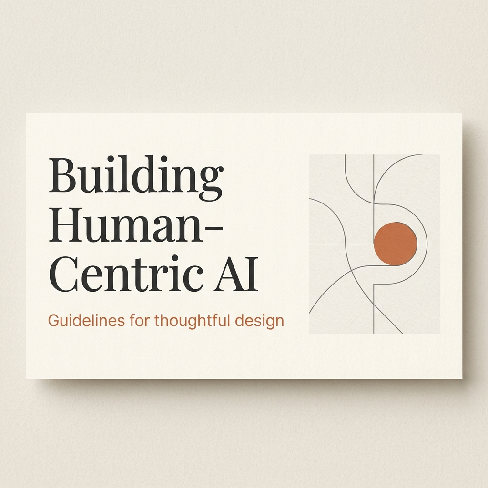
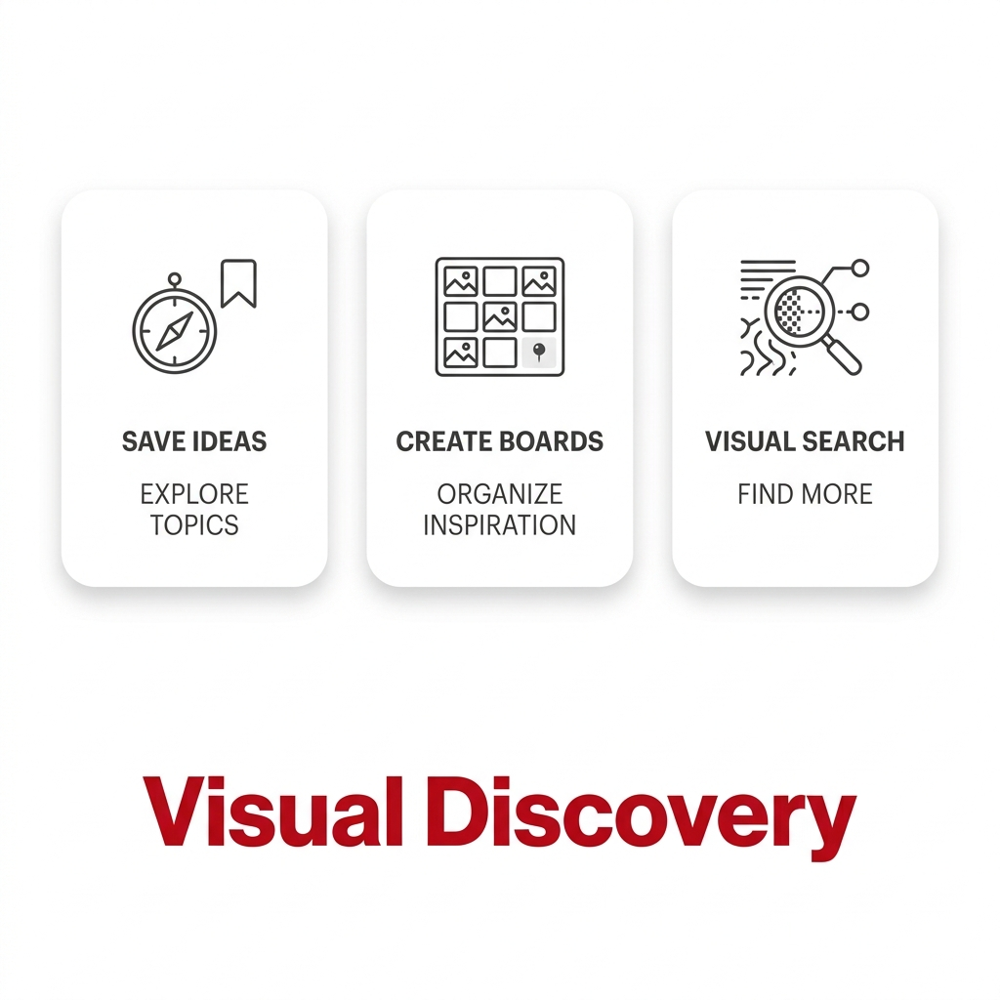

# NotebookLM Slide Styles Collection

A curated collection of visual design styles (YAML) to customize the output of NotebookLM slide generation.

## 📖 Table of Contents
- [🏷️ Brand Inspired](#-brand-inspired)
  - [Claude Aesthetic](#claude-aesthetic)
  - [Pinterest Aesthetic](#pinterest-aesthetic)
- [🌿 Minimalist](#-minimalist)
- [🎨 Creative](#-creative)
- [🚀 How to Use](#-how-to-use)
- [🛠️ Contribution](#-contribution)

---

## 🎨 Themes

### 🏷️ Brand Inspired

#### Claude Aesthetic
Inspired by Anthropic's sophisticated, editorial, and human-centric design language. It uses warm cream backgrounds, bold terracotta accents, and elegant serif typography to create a "book-like" presentation feel.



```yaml
design_system:
  global_style:
    theme: "Minimalist, sophisticated, and human-centric. Inspired by Anthropic's 'Claude' brand identity."
    typography: 
      primary_heading: "Elegant serif (e.g., Lora, Playfair Display), bold"
      secondary_heading: "Clean sans-serif (e.g., Poppins, Inter), uppercase"
      body_text: "Refined serif (e.g., Lora), airy line-height"
    color_palette:
      primary_color: "#D97757"
      background: "#FAF9F5"
      text_main: "#141413"
    key_visual_elements: 
      - "Generous whitespace (Editorial layout)"
      - "Abstract geometric line art"
      - "Pill-shaped labels"

slide_layout_templates:
  - type: "Cover_Editorial"
    usage: "Main title slide"
  - type: "Split_Insight"
    usage: "40/60 text-image split"
```

#### Pinterest Aesthetic
Inspired by Pinterest's signature discovery aesthetic. This style focuses on visual-first layouts, card-based components with high border-radius, and vibrant red accents to drive engagement and focus.



```yaml
design_system:
  global_style:
    theme: "Modern, visual-first, and organized. Inspired by Pinterest's discovery aesthetic."
    typography: 
      primary_heading: "Clean rounded sans-serif (e.g., Roboto, Helvetica Rounded), bold"
      secondary_heading: "Simple sans-serif, medium weight, clean"
      body_text: "Functional sans-serif, high contrast on white"
    color_palette:
      primary_color: "#E60023"
      background: "#FFFFFF"
      text_main: "#111111"
      accent_color: "#EFEFEF"
    key_visual_elements: 
      - "Rounded corners (16px to 24px) for cards and images"
      - "Drop shadows for depth (Pin-style)"
      - "Grid-based image distribution"

slide_layout_templates:
  - type: "Cover_Discovery"
    usage: "Impactful intro slide"
  - type: "Card_Grid_Insights"
    usage: "Presenting multiple features in card format"
```

---

### 🌿 Minimalist
*Incoming soon...*

### 🎨 Creative
*Incoming soon...*

---

## 🚀 How to Use
1. Copy the YAML code block for your desired theme.
2. Paste it into your NotebookLM prompt or configuration when generating slides.
3. Enjoy your beautifully styled presentation!

## 🛠️ Contribution
Feel free to add more styles by creating a YAML file in the `styles/` folder and updating this README under the appropriate category.
